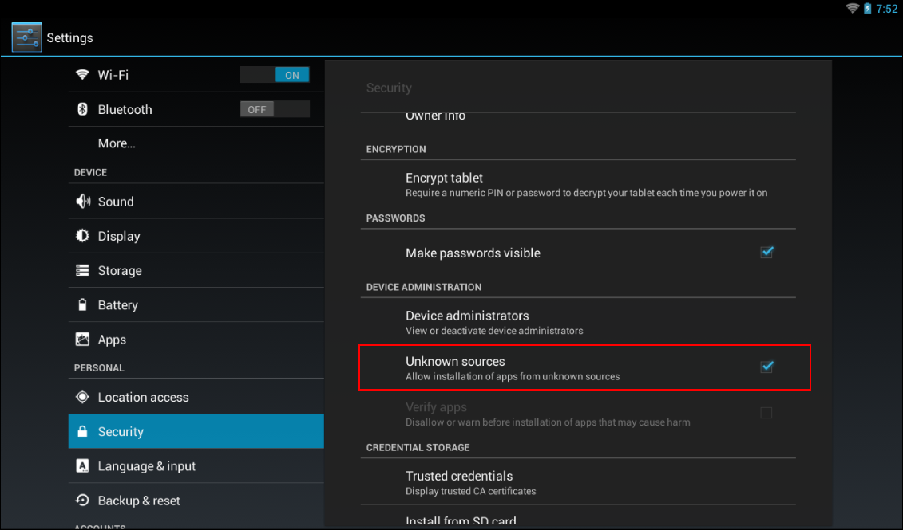
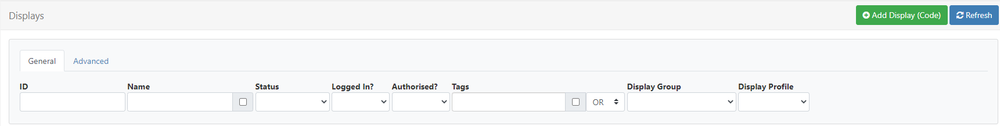
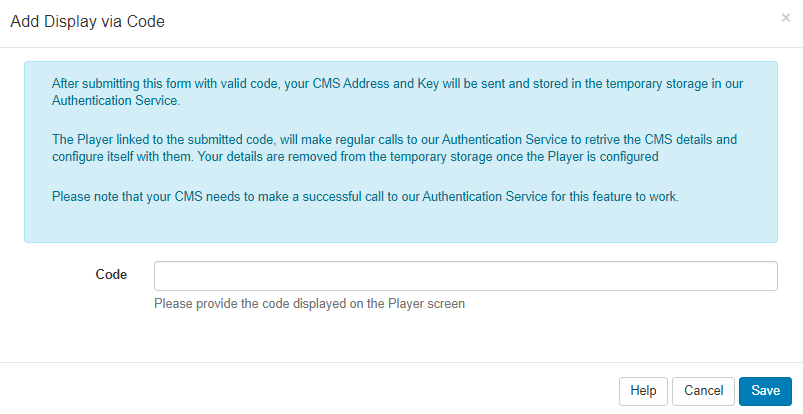
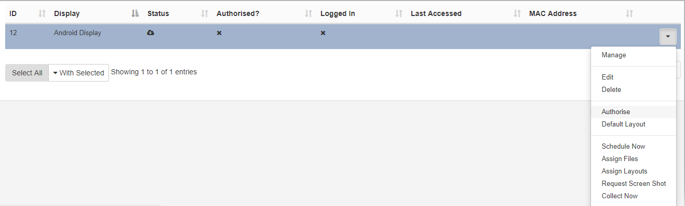
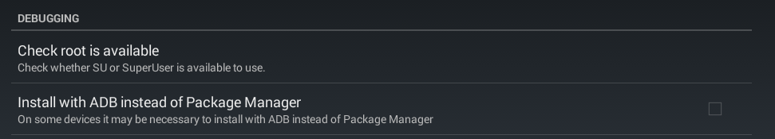
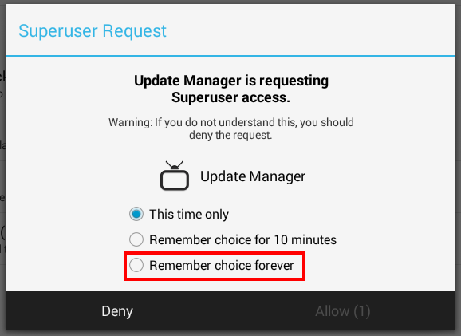
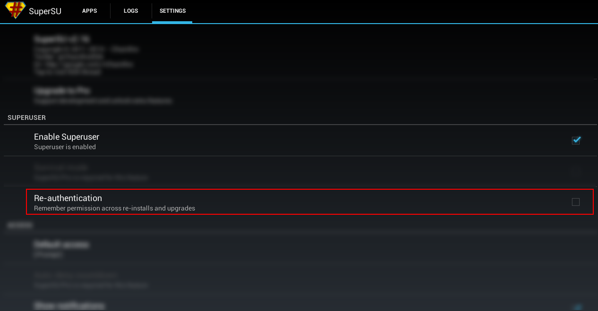

<!--toc=android_install-->

# Androidプレーヤーのインストール

Xibo for Androidは、スタンドアロンの「APK」インストーラーファイルとしてリリースされており、[ダウンロード://xibosignage.com/downloads)セクションから入手することができます。

ダウンロード後、[Xibo for Android](https://xibosignage.com/xibo-for-android)のインストールと設定は簡単で、わずか数分で運用を開始することができます。

{nowhite}
注意：Xibo for Androidの使用は、すべてのプランに含まれており、別途ライセンスが必要なわけではありません。必要なライセンス情報フィールドは、プレーヤーとCMSを接続するために自動的に補完されます。
{/nowhite}

実行するデバイスごとにXibo for Androidソフトウェアライセンスを購入し、それを**ライセンスプール**にリンクさせる必要があります。

{tip}
詳しくは[プレーヤーライセンス](licensing-your-commercial-xibo-player.html)をご覧ください。
{/tip}

このガイドでは、インストールに必要な各ステップについて、以下の手順で詳しく説明します。

- デバイスの準備
- Xibo for Android APKをダウンロードする
- Xibo for Android APKのインストール
- CMSへの接続
- ディスプレイの認証
- ライセンス認証

## デバイスの準備

### Google Play 対応外ソース

Xibo for AndroidはGoogle Play 対応外のAndroidアプリケーションです。つまり、デバイスは提供元不明のアプリケーションのインストールを許可するように設定する必要があります。この設定は、Android標準の「設定タブ」の「セキュリティ」または「アプリケーション」セクションで確認することができます。

自動更新が必要な場合を除き、インストール後はこの設定を無効にする必要があります（詳しくは以下の**Root化されたデバイス**ご覧ください）。

### 無線LANアダプターを有効にする

**Xibo for Android**は無線LANアダプタのMACアドレスを取得し、CMSに記録しようとしますが、これはWifiアダプタが有効になっている場合にのみ可能です。

**ディスプレイ**を初めて接続するときは、無線LANアダプターを有効にしておく必要があります。設定中に**Xibo for Android**から離れる必要がないように、インストール前にこの作業を行っておくとよいでしょう。ディスプレイをCMSに接続した後は、ワイヤレスアダプターをオフにすることができます（もちろん、使用する場合を除きます！）。

### 日付と時刻

デバイスの**日付／時刻**と**タイムゾーン**が正しく設定されていることを確認します。この情報は、**Xibo for Android**で時間的制約のあるスケジュールや、14日間の試用に使用されます。

**注意：**インストール時にこの情報が正しく設定されていない場合、Xibo for Androidの14日間体験版が早く終了してしまう可能性があります。

{tip}
Androidでタイムゾーンを変更するための[ヘルパーコマンド](helper-command-to-change-time-zone.html)はこちらです。
{/tip}

## Xibo for Android APKのダウンロードとインストール

{tip}
**注意：**バージョンに関係なくAndroid 7.1以降での動作を強く推奨しています。[対応バージョンと環境](supported-versions-and-environments.html)
{/tip}

**Xibo for Android**は、Android OSで開いてインストールできるAPKファイルとして公開されています。インストールするには、最新の**Xibo for Android APKリリースファイル**をお使いのデバイスにダウンロードまたは転送する必要があります。

最も簡単な方法は、ここから直接、お使いのデバイスの最新リリースを選択し、ダウンロードすることです。[ダウンロード](https://xibosignage.com/downloads)

**Xibo for Android**をダウンロード、インストールして使用するには、[エンドユーザーライセンス契約（EULA）](https://xibosignage.com/eula)に同意する必要があります。

上記の準備が完了すると、Google Play 非対応アプリケーションをインストールできるデバイスができ、Wifiアダプターが有効で、正しい日付／時刻／タイムゾーン、最新の**Xibo for Android APKファイル**がデバイスにダウンロードされているはずです。

## Xibo for Android APKをインストールする

- APKファイルを開き、クリックしてインストールします。

**Xibo for Android**はいくつかのパーミッションが必要な場合がありますが、最小限にとどめるよう努力しています。

- 表示された権限を承認し、インストールが完了するのを待ちます。

これで、**Xibo for Android**がアプリドロワーに表示されます。

## CMSに接続する

インストール後、アプリドロワーでXiboを開き、2つの方法のうちの1つを使って**ディスプレイ**に接続します。

1. コードを使用する（v2 R204 以降、対応する Android APK ファイルで使用可能）
または

2. 手動設定(CMSアドレスとキー)

### コードを使用する

- **Use Code**をクリックすると、6文字のActivation Codeが表示されます。ディスプレイの管理画面でコードを入力し、プレーヤーが自動的に起動するまで、このフォームが開いたままであることを確認してください。このフォームを閉じると、コードが非表示になり、設定が停止します。

- CMS の [ディスプレイ] ページに移動し、ページの上部にある [ディスプレイ (コード) を追加] ボタンをクリックします。

- プレーヤー画面に表示されているように、**アクティベーションコード**を入力します。

- 保存します。

設定に成功すると、[プレーヤーのアクティベーション] ページが自動的に閉じます。

ディスプレイが登録され、認証待ちの状態になります。

以下の**ディスプレイの認証**セクションから続けてください。

### 手動設定

- **CMS Address** - CMS インストールの完全修飾アドレスを入力します。例：https://cms.example.org または http://example.org/cms
- **CMS Key** - このディスプレイをCMSで認証するための秘密キーです。
- **Connect CMS** - 最初の接続に成功すると、「Display is registered and awaiting authorisation from an administrator in the CMS（Displayは登録されており、CMSの管理者からの承認を待っています）」というメッセージが表示されます。

CMSとプレーヤー間の通信にエラーがない場合、ディスプレイは登録され、以下の**ディスプレイの認証**セクションで説明するように認証を待っている状態になります。

{tip}
**CMS key**は、CMSの**管理**メニューから**設定**をクリックし、**設定**タブに移動して確認することができます。
{/tip}

## ディスプレイの認証

プレーヤーが[スケジュールされたイベント](/manual/ja/scheduling.html)を受信し、レイアウトを表示する前に、ディスプレイをCMSに接続するよう**認証**する必要があります。

- **CMS**にログインし、メインメニューから**ディスプレイ**をクリックすると、リストに新しく登録されたプレーヤーが表示されます。

- このプレーヤーの行メニューをクリックし、リストから**認証**を選択します。

- **はい**をクリックして、このディスプレイの認証を確認します。

この時点で、新しいプレーヤーを実行するための**デフォルトレイアウト**を選択することができます。

## ライセンス認証

Androidのディスプレイで、デバイスの右上にある3つのドットのメニューボタンにアクセスして**設定メニュー**を使用し、**Connect**をクリックします。**CMS Address**と**CMS Key**を確認し、**接続**するよう求められます。

CMSの**ディスプレイ設定プロファイル**にライセンスプールの**ライセンスコード**が設定されている場合、Xiboはすぐに起動し、CMSからコンテンツをダウンロードします。ライセンスプールコードが提供されていない場合は、デバイスにこの情報を求めるページが表示されます。

{tip}
Android 用の表示設定プロファイルを作成することで、CMS 自体で設定の大部分を行うことができます（ここでライセンスプールの情報を入力します）。
{/tip}

無料トライアルをご利用の場合は、このステップを「スキップ」してください。

ライセンス認証を行うか、スキップしてトライアルを有効にすると、Xiboが完全に起動し、CMSからコンテンツをダウンロードします。

## 表示設定のプロファイル

デフォルトのプロファイルが用意されています。これらのデフォルトを上書きしたい場合、またはライセンスプールコードをすべてのデバイスに一元的に提供したい場合のみ、表示設定プロファイルを作成する必要があります。

{tip}
利用可能な設定の詳細については、[Androidプレーヤー設定](android-player-settings.html)と[ディスプレイ設定](/manual/ja/displays_settings.html)のページを参照してください。
{/tip}

## root化された端末

root化されたAndroid端末は、自動更新機能を利用することができます。

### 動作環境

- Xibo CMS 1.6.1以上
- Xibo for Android R53以降
- Android 4.1以上、1.8 R101以降Android 4.4以上
- 端末のRoot権限（SUまたはSuperUserがインストールされていること）

**Xibo for Android**はいくつかのパーミッションを必要としますが、最小限に抑えるようにしています。インストールが完了すると、Xibo for Androidが起動します。

これで**Xibo for Android**は通常通りアプリドロワーで利用できるようになります。

## 端末の準備

root権限と、SuperUserなどの適切なroot管理アプリがある端末をご用意ください。また、Xibo for Android R53以降がインストールされ、設定されている必要があります。詳細および一般的な手順については、[デバイスをRoot化する]()を参照してください。

### ルートアクセス権の付与
Xiboアプリケーションは、デバイスへのルートアクセスを許可する必要があります。これは、「設定」メニューから行います。

**Check root is available**をクリックまたは押すと、下図のようなポップアップウィンドウが表示され、確認が要求されます。この時点で、Xiboはrootへの永続的なアクセスを必要とするため、アップデート処理中にこれ以上ユーザーの操作が必要になることはありません。

{tip}
ポップアップウィンドウが開かない場合は、デバイスでルートアクセスが正しく設定されていないことを意味します。
{/tip}

**Allow**を選択すると、スーパーユーザーアクセスが許可され、プレイヤーでの自動アップデートの設定が完了した旨のメッセージが表示されます。

### SuperSu
SuperSu を使用している場合、「再認証」設定が無効になっていることを確認する必要があります。この設定を無効にしないと、アップグレード後にアプリケーションのルートアクセスが失われます。

## アップグレードウィンドウの設定

プレイヤー アプリケーションのアップグレードに特定の時間を設定したい場合は、CMS で**ディスプレイ設定プロファイル**を作成し、それをディスプレイに割り当てる必要があります。

アップグレードの詳細については、[Xibo for Androidのアップグレード](upgrading-xibo-for-android.html)を参照してください。

