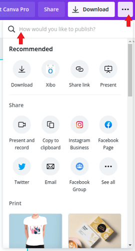
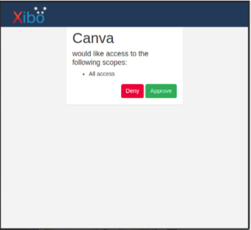
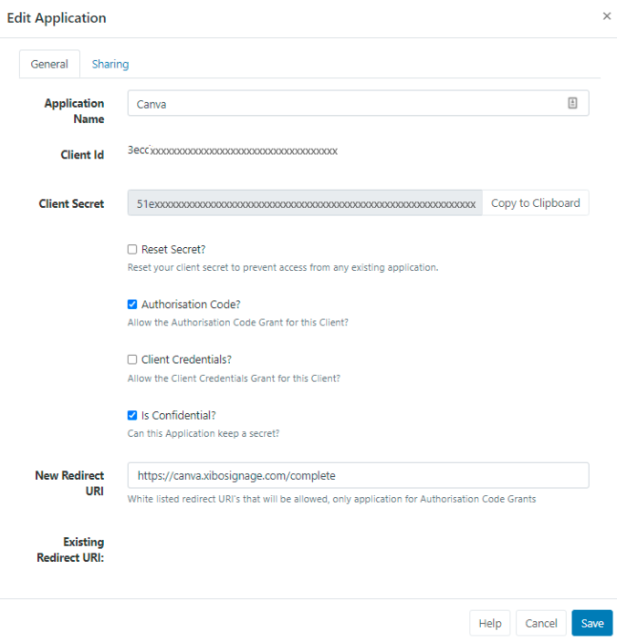
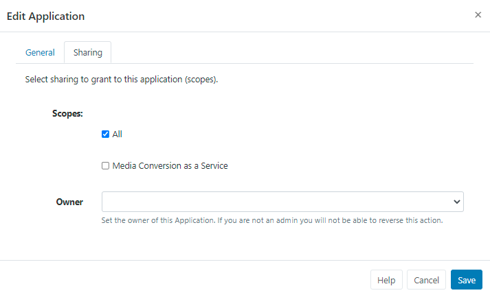
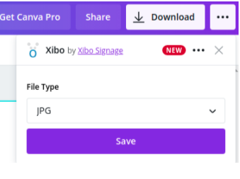
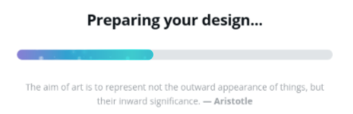
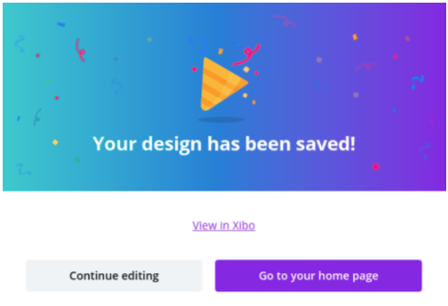
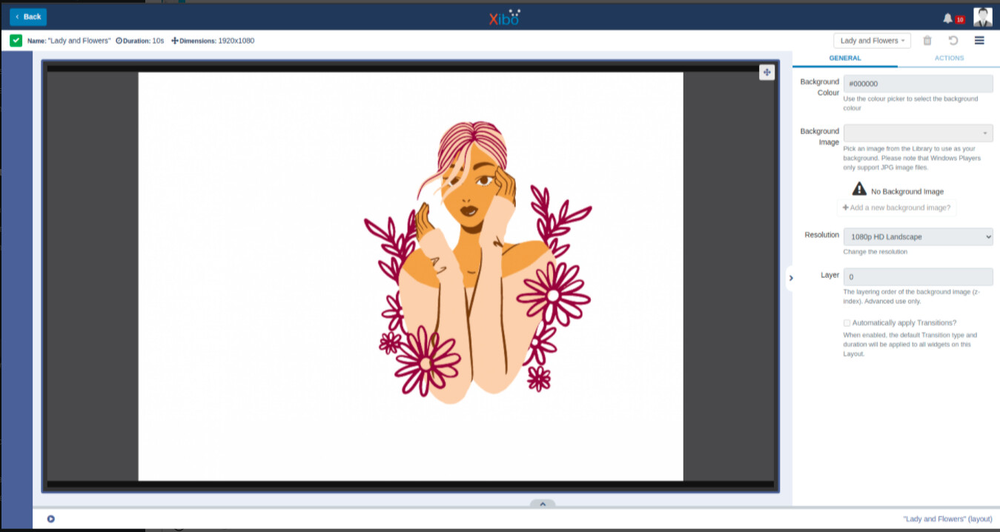

<!--toc=cms_config-->

# Canvaとの連携

Canva で作成したデザインを Canva ダッシュボードから離れることなく直接 Xibo レイアウトに掲載できます。

**注意：**Canvaと[[PRODUCTNAME]] Canvaアプリがデザインを公開するためには、HTTPSでCMSにアクセスする必要があります。CMSがHTTP経由でしか利用できない場合や、プライベートネットワーク上にある場合は、アプリを使用することはできません。

##Xiboを使用してCanvaから初めて公開する方法

Canvaのダッシュボードから、次のステップを完了します。

- **Create a Design** を選択します。
- **Presentation 1920x1080** を選択するか、意図するディスプレイの画面解像度に合わせてカスタムサイズを作成します。
- Canvaを使用して、コンテンツを作成し、保存します。
- 保存したら、画面の右上にある3つの点をクリックします。
- 検索フィールドの「How would you like to publish?」に**Xibo**と入力してください。

{tip}
おすすめリストにXiboが表示され、選択できるようになります。
{/tip}

- **Connect** をクリックします。

{tip}
初めてXiboに公開する場合、またはしばらく公開していない場合は、「接続」するように指示されます。
{/tip}

- Connect to Xibo ポップアップが表示されます。

![Canva Connect Xibo}(img/canva_connect_xibo.png)

{tip}
`"canva.xibosignage.com"`のURLを確認することで、Xiboからの接続であることを確認することができます。のURLを確認し、安全な接続を示す南京錠のアイコンが表示されていることを確認することで、Xiboからの接続であることを確認できます。
{/tip}

- **CMSの完全なURL** `https://`を入力します。
- **Connect** をクリックし、以下の該当するセクションの手順に従います。

## Xibo CloudがホストするCMSに接続する

- 接続をクリックすると、CMSに直接アクセスし、ログインするよう求められます。
- **Approve** をクリックして、Canvaのフルアクセスを許可します。

## セルフホスト/オンプレミスCMSへの接続

- **Client ID**と**Client Secret**を入力するよう促されます。
- これらの認証情報を取得するには、**スーパー管理者ユーザー**としてCMSにログインし、**アプリケーション**ページに移動して "Canva "という新しいアプリケーションを作成する必要があります。

- **認証コード**にチェックを入れます。
- ** 機密事項**ですにチェックを入れる。
- **新しいリダイレクトURI**フィールドに `https://canva.xibosignage.com/complete` と入力します。
- **共有**タブでスコープを**すべて**にチェックします。

- **Client ID**と**Client Secret**をメモしておく。
- **保存** をクリックします。
- ** Connect to Xibo**ポップアップに、Client IDとClient Secretを入力します。
- **登録**をクリックします。

登録が完了すると、CMSに戻り、Canvaのアクセス権付与のための承認が完了します。

## Xiboへの公開

- 承認されたら、ドロップダウンで使用するファイル形式を選択します。

- **Save**をクリックする

保存に成功したら、Canvaで現在のデザインの編集を続けるか、Canvaのホームページに戻るか、または**View in Xibo**で表示をクリックしてレイアウトに直接アクセスすることができます。

公開されたレイアウトはXiboで表示されます。

## よくある質問
> Q: Xiboに公開できるファイル形式は何ですか？
> 
>A: 現在、JPGとPNGの画像形式をXiboに公開することができます。今後、より多くのフォーマットを提供できるよう、Canvaチームと協働しています

> Q: ホワイトラベルはどうなりますか？
> 
> A: 残念ながら、Canvaアプリはホワイトラベルを付けることができません。

> Q: デザインのたびに新しいレイアウトを作成するのではなく、CanvaからXiboに画像をアップロードするだけでいいのですか？
> 
> A：どちらか一方を選択する必要がありましたので、レイアウトを作成するよりも削除する方が簡単であるという理由から、フルレイアウトを選択しました。

> Q: Canvaで「デザインの公開に問題があります」というエラーメッセージが表示されるのですが？
> 
> A: ユーザーがCMS内で標準の「1080p HD Landscape / 1080p HD Portrait」解像度を削除した場合、Canvaから公開するユーザーは、正常に公開するために解像度を作成する機能アクセス/権限が必要です。

> Q: Canvaアプリのサポートはどこで受けられますか？
>
>A: Xiboクラウドホスティングをご利用のお客様は、マイアカウントからチケットを発行してください。セルフホスティング/オンプレミスの場合は、Xibo CommunityのGet Helpセクションにトピックを作成してください。

> Q: オンプレミスのCMSを接続することはできますか？
> 
>A: 可能ですが、CanvaとXibo Canvaアプリはデザインを公開するために、HTTPSでCMSにアクセスする必要があります。CMSがHTTP経由でしか利用できない場合や、プライベートネットワーク上にある場合は、アプリを使用することはできません。

> Q: 次のようなCanvaの接続エラーが発生します `{"error": "invalid_client", "error_description": "Client authentication failed", "message": "Client authentication failed"} ?` 
> 
> A: エラーメッセージはクライアント情報が正しくないことを示しています。このリンクにアクセスしてCMS認証情報を手動で修正してください。[登録｜Xibo Canva Connector](https://canva.xibosignage.com/register)
