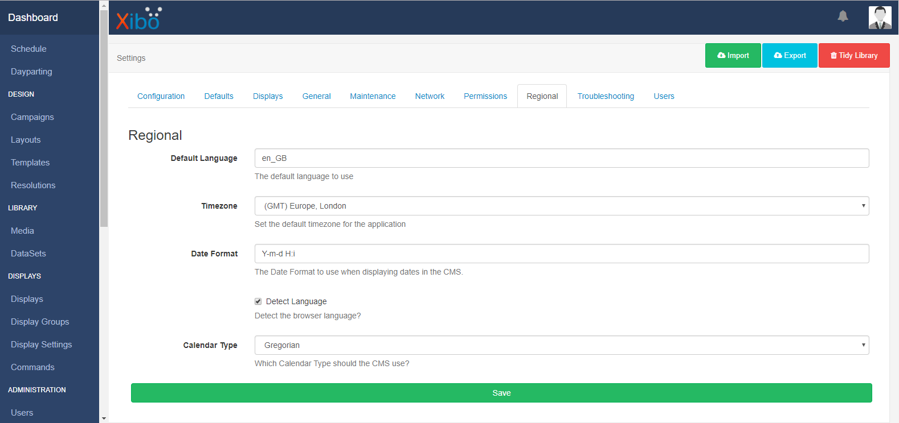
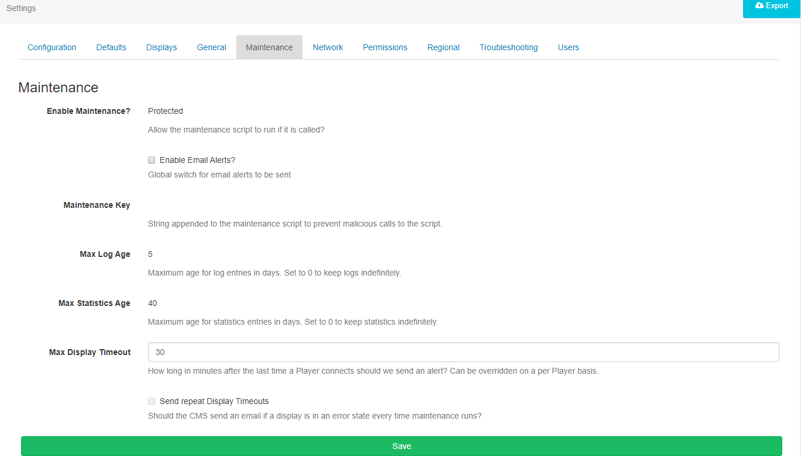
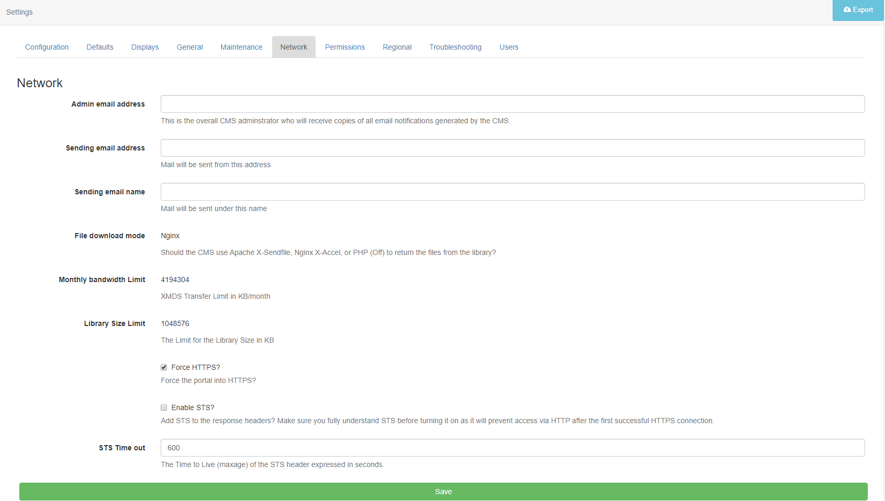
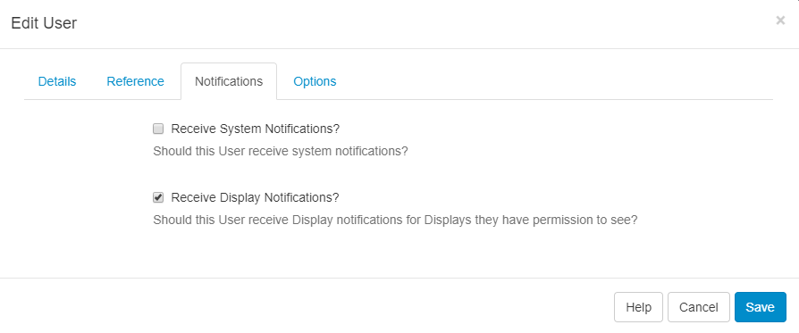
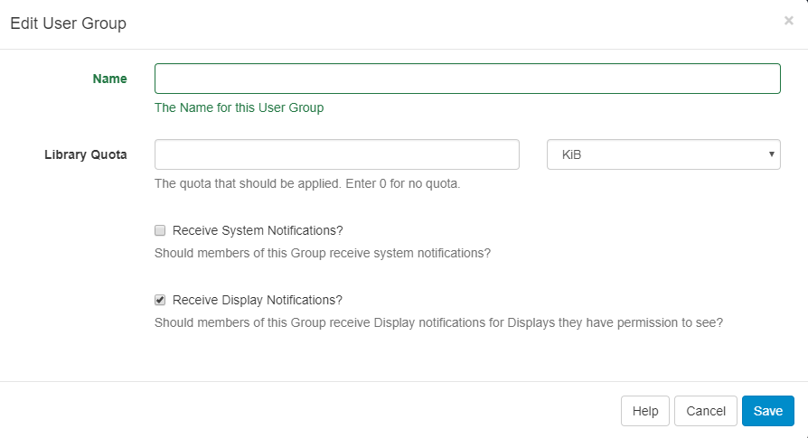
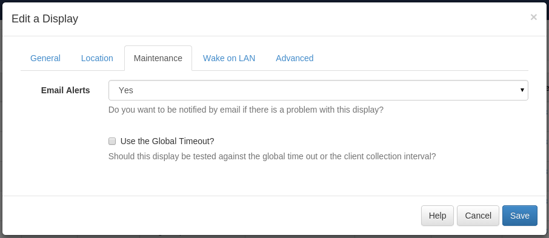
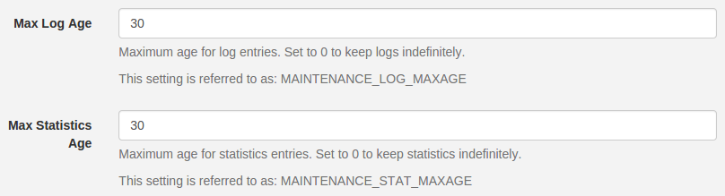
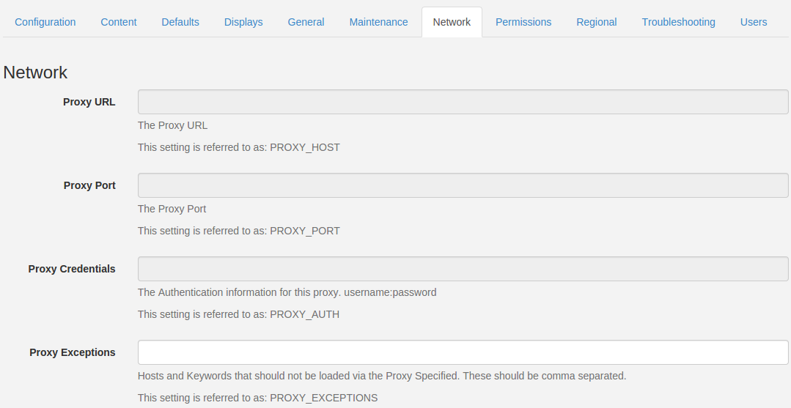
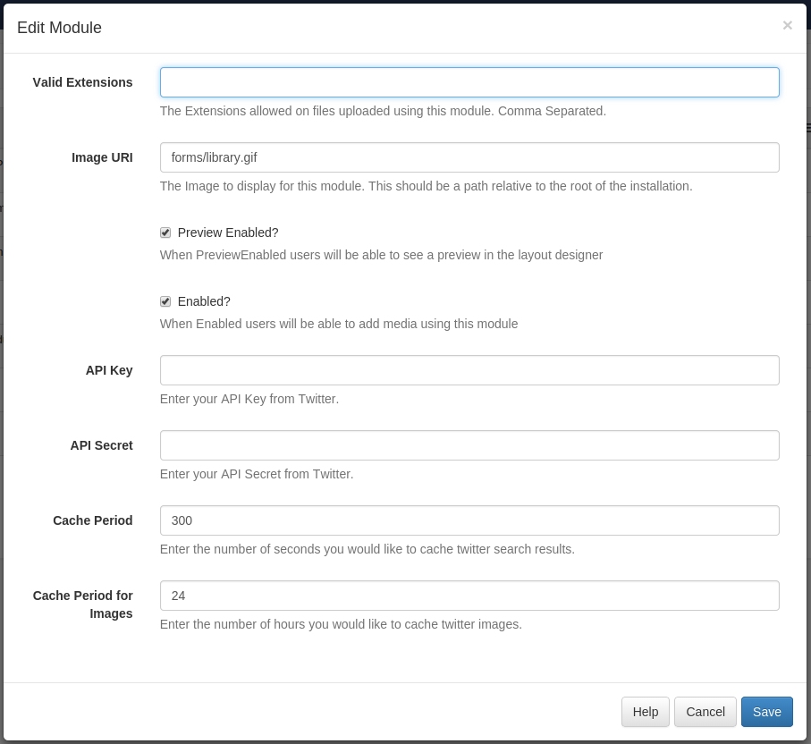

<!--toc=cms_install-->

# インストール後の設定

[[PRODUCTNAME]] CMSをインストールした後、すべての機能を有効にし、スムーズに動作させるために、いくつかの追加設定が必要です。

[[PRODUCTNAME]] CMSをまだインストールしていない場合は、お使いの環境に適した[CMSのインストール手順](cms-installation-guides.html)をご覧ください。

また、[[PRODUCTNAME]]クラウドホスティングをご利用いただくと、以下のような事前設定を省略することができます。

[Docker](cms_install_docker.html)を使用している場合、CMSにテストファイル（イメージなど）をアップロードし、同じイメージがローカルファイルシステムのshared/cms/libraryディレクトリに表示されることを確認してください。そうでない場合は、変更が保存されない可能性があるため、先に進まないでください。

## 時刻とタイムゾーン

### NTP

CMSの時刻が正しいこと、そして**CMSのタイムゾーン**設定が作業中のタイムゾーンに対して正しく設定されていることは、非常に重要なことです。

また、インターネットから自動的に時刻を同期するようにOSを設定することで、常に正しい時刻を表示することができます。

ntp.orgは、CMSクロックの同期に使用できるタイムサーバーへのアクセスを無料で提供しています。

ntp.orgのサーバーにアクセスするための設定方法は、[こちら](http://www.pool.ntp.org/en/use.html)をご覧ください。

### タイムゾーン

あなたの時計が正しくなったら（自動的に正しくなる）、CMSに使用する**タイムゾーン**を知らせる必要があります。

インストーラは、あなたのOSが使用するように設定されているタイムゾーンを推測しようとしますが、常に最適な選択ができるわけではありません。

- CMSにログインし、メニューの**管理セクション**にある**設定ページ**で、**地域タブ**をクリックします。

- ドロップダウンメニューを使用して、タイムゾーンで最も近い主要都市を選択し、ページ下部の保存をクリックします。

## CMSのメンテナンスとメールアラート

[[PRODUCTNAME]] CMSは、**ユーザー**がシステムと積極的にやり取りしているとき、または**プレーヤー**がコンテンツを更新するために接続しているときのみ、常に稼働しています。つまり、特定のバックグラウンドルーチン（古い記録の削除など）を実行したり、プレーヤーが予想通りに接続しなくなった場合に警告を出したりするためには、Xiboを定期的に「起動」して、これらの処理を実行する必要があります。Xiboは、これらのルーチンを実行するために、**Tasks**と**XTR**を使用しています。

**Dockerのインストール**では、**XTR**の実行は自動的に行われます。

{tip}
非 Docker およびカスタム/手動インストールでは、Apache/ISS インストールページの指示に従い、XTR が正しく設定されていることを確認してください。
{/tip}

### メールアラート

CMSが定期的に起動されるようになったので、プレーヤーが正しく接続できなくなったときや、ダウンタイム後にオンラインに戻ったときに送信される**メールアラート**をオプションで設定することができます。

CMSのメインメニューの**管理**セクションにある**設定**ページで、**メンテナンス**タブをクリックします。

- **メールアラートを有効にする**にチェックを入れます。(`maintenance_email_alerts`)
- **ディスプレイのタイムアウトの最大値**（`MAINTENANCE_ALERT_TOUT`）- プレーヤーがCMSに最後に接続してから「オフライン」になったとみなされるまでの時間を分単位で入力します。この値は、必要に応じてクライアントごとに上書きすることができます。この値は、通常のプレーヤー収集間隔より低く設定しないでください。疑問がある場合は、高く設定してください。デフォルトは30分です。
- **ディスプレイタイムアウトを繰り返し送信する**（`MAINTENANCE_ALWAYS_ALERT`） - **オン**に設定すると、オフラインの各ディスプレイに対して、maintenance.phpルーチンが実行されるたびに電子メールが送信されます。ほとんどの人は、これを**オフ**に設定すると、ダウンタイム期間ごとに1回だけ通知されるようになります。
また、**ネットワーク**タブでメールの送信に関する情報を提供する必要があります。

- **管理者Eメールアドレス**（`mail_to`）- ディスプレイがオフラインになったとき、またはオンラインになったときに電子メールを受信する電子メールアドレスを入力します。
- **送信Eメールアドレス**（`mail_from`）- CMSからのアラートを送信する電子メール・アドレスを入力します。(**注意**: このフィールドは、Eメール通知を設定する前に入力する必要があります)
- ページ下部の**保存**ボタンをクリックして、設定を保存します。

プレーヤーがオフラインになったとき、**ユーザー/ユーザーグループ**に警告を出すと便利な場合があります。

- これを行うには、**管理**セクションの**ユーザー**に移動し、選択したユーザーレコードの行メニューを使用し、**編集**を選択します。
- **通知**タブをクリックし、**ディスプレイ通知を受信**にチェックを入れます。

これは、ユーザーグループに対して設定することもできます。

次に、どの**ディスプレイ**でアラートを受信するかを決定します。

- CMSメニューから**ディスプレイ**に移動し、アラートを受信したい各ディスプレイについて、行メニューの**編集**を使用してから**メンテナンス**タブをクリックします。

- **Eメールアラート**が**はい**に設定されていることを確認します。
- Eメールアラートを受信したくないディスプレイについては、**Eメールアラート**を**いいえ**に設定します。

ディスプレイ設定のプロファイル（以下のセクションを参照）を使用していない場合、[グローバルタイムアウトを使用しますか]チェックボックスをオンにし、警告を受ける前にオフラインにする必要があるディスプレイの時間について、先に設定した値が使用されるようにしてください。

ディスプレイ設定のプロファイルを使用している場合、そのボックスをオフにすると、ディスプレイプロファイルの収集間隔が代わりに使用されます。

電子メールアラートを設定すると、ディスプレイの1つをオフにした場合、電子メールで通知されるようになります。電子メールは、プレーヤーが最後に接続してから Global Timeout または Display Profile Collection Interval が経過すると、メンテナンス スクリプトの次の実行時に送信されます。

{tip}
**例** グローバルタイムアウトが10分で、メンテナンススクリプトが5分ごとに実行されるように設定されている場合、プレーヤーが最後に接続してから最大で15分間通知が行われない可能性があります。
{/tip}

プレーヤーがオンラインに戻ると、電子メールで即座に通知されます。

{tip}
注意：使用中のプレーヤーが起動時にCMSに複数の同時呼び出しを行った場合、複数の復旧メールが送信されます。
{/tip}

## ログと統計情報の保持

CMS は、動作中にログを生成し、またデバッグやシステムの状態を確認する目的で、CMS に接続されたプレーヤーからログ出力を受け取ります。また、[実行証明情報](/manual/ja/displays_metrics.html#実行証明)を収集することもできます。

これらの記録はすべてデータベースに保存され、データベースのサイズを管理しやすくし、システムパフォーマンスの問題を防ぐために、定期的にパージされる必要があります。メンテナンススクリプトは、その機能を実行します。

CMSメインメニューの**管理**セクションにある**設定**ページに行き、**メンテナンス**タブをクリックします。

- **最大ログ期間**（`MAINTENANCE_LOG_MAXAGE`）は、自動的に削除される前にCMSデータベースに保存されるログの日数を制御します。5に設定すると、ログは5日間保持され、ほとんどのデバッグ目的には合理的です。
- **最大統計時間**（`MAINTENANCE_STAT_MAXAGE`）は、再生証明の統計情報をCMSデータベースに保存してから自動的に削除されるまでの日数を制御します。30に設定すると、統計は30日間保持されます。監査目的で統計情報を保持する必要がある場合は、CMSの**統計情報**ページからエクスポートしてアーカイブし、後で使用することができます。

## 地域設定

[[PRODUCTNAME]]には、ユーザーインターフェイスを別の言語で表示したり、日付を別のフォーマットで表示したりする機能が組み込まれています（例：DD/MM/YYYY vs MM/DD/YYYY）。

すべての翻訳はコミュニティによって提供され、我々はシステムの翻訳を更新し、正確に保つために、すべてのコミュニティの努力に非常に感謝しています。もし特定の言語の翻訳を改善することに興味があれば、[Launchpad Translations](https://translations.launchpad.net/xibo)から直接貢献することができます。

{tip}
そこで行われた編集は、将来の[[PRODUCTNAME]] CMSのリリースに自動的に含まれます
{/tip}

## 言語検出

デフォルトでは、CMS はブラウザで設定された言語設定を使用して、CMS インターフェイスを表示する言語を自動検出します。例えば、CMSのごく一部が特定の言語に翻訳されている場合、言語検出を無効にして、代わりに特定の言語を強制することが望ましい場合があります。

- CMSの**設定**ページで、**地域**タブに移動します。
- **言語検出** (`DETECT_LANGUAGE`) のチェックボックスをオフにします。
- 適切な**デフォルト言語**を選択する（以下のセクションを参照）。
- 変更を**保存**する

### 既定の言語

あなたが言語検出を無効にした場合、CMSは、その翻訳を取得するためにどの言語ファイルを知っている必要があります。

- CMSの**設定**ページから、**地域**タブに移動してください。
- デフォルト言語は`en_GB`で、英語（英国）の翻訳が得られます。[[PRODUCTNAME]]が現在翻訳されている言語の一覧から、有効なコードを入力することができます。リストはこちらでご覧いただけます。
- 言語コードは、末尾の.moを除いたものを入力してください。例えば、スペイン語を選択する場合は、`es`と入力します。
- 変更を保存する

## 地域別の日付形式

[[PRODUCTNAME]] CMSのデフォルトでは、日付は`Y-m-d H:i` 形式で表示されます（例：2015-03-29 10:00:00）。

- CMS全体で使用される日付形式は、**設定画面**から**地域**タブの**日付形式設定**を調整することで調整できます。

## ディスプレイプロファイル

ディスプレイプロファイルは、CMSからプレーヤーの設定を一元的に設定する強力な方法です。

プレーヤーがCMSに接続すると、作成したデフォルトまたは割り当てられた**プロファイル**を受け取り、それらの設定で自動的に再設定されます。

- プロファイルは CMS の ディスプレイ設定ページにあります。プレーヤータイプごとにデフォルトのプロファイルを作成したり、個別のプロファイルを作成して1人または複数のプレーヤーに適用し、デフォルトの設定を上書きすることができます。

{tip}
**ディスプレイプロファイル**の管理に関する詳細は、ユーザーマニュアルの[ディスプレイ設定](/manual/ja/displays_settings.html)ページに記載されています。
{/tip}

## 収集間隔に関する重要な注意事項

[[PRODUCTNAME]]にはXMR（Xibo Message Relay）プッシュ技術が搭載されており、CMS内のディスプレイに割り当てられたコンテンツを変更すると、プレーヤーにその更新を直ちに接続しダウンロードするよう通知されるのがデフォルトとなっています。したがって、プレーヤーに比較的長い収集間隔を設定することを強くお勧めします。これは、プッシュ メッセージの見逃しに対するフェイルセーフとしてのみ機能するからです。

{tip}
CMS とプレーヤーに 1 分の収集間隔を設定することはできません。通常の運用では5分が最低ラインですが、この値を**30分**以上に設定することを強くお勧めします。
{/tip}

## プロキシ設定

CMSは、ローカルネットワーク外の**RSS**フィードを取り込むため、または[Twitter](/manual/ja/media_module_twitter.html)などの統合のために、外部サーバーに接続できる必要があります。

ネットワークがプロキシサーバーを使用している場合、[[PRODUCTNAME]] CMSにプロキシサーバーについて知らせ、どこを見ればよいかを知る必要があります。

CMSメインメニューの**管理**セクションにある**設定**ページで、**ネットワークタブをクリックします。

ネットワーク上のプロキシサーバーの詳細を入力します。プロキシサーバーの詳細が不明な場合は、ネットワーク管理者がお手伝いします。

- `プロキシURL(PROXY_HOST)`には、プロキシサーバーのhttp URLを指定します（例：`http://proxy.mydomain.com` または `http://192.168.1.8`）。
- `プロキシポート(PROXY_PORT)` は、プロキシサーバが listen しているポート番号です (例: `3128` または `8080`)。
- 'プロキシ認証(PROXY_AUTH)' は、プロキシサーバを使用するために必要なユーザ名とパスワードを、`ユーザ名:パスワード`の形式で指定します (例 `jdoe:secretPassword`)。プロキシが認証されたアクセスを必要としない場合は、これを空白にしておきます。
- `プロキシ例外(PROXY_EXCEPTIONS)` は、プロキシサーバへの送信から除外されるべきホストやキーワードを指定します。例えば、イントラネットサーバーがある場合、`intranet.domain.com`と入力することで除外することができます。カンマで区切ることで、複数のエントリを含めることができます。プロキシの例外を必要としない場合は、この項目を空白にします。
- ページの一番下にある変更内容を**保存**します。

## サードパーティとの連携

### 天気予報APIキー

[[PRODUCTNAME]] CMS は [OpenWeather](https://openweathermap.org/) との統合により、天気予報と現在の天候を表示する機能を備えています。

- OpenWeatherへのアクセスは保護されているため、ユーザーは[[PRODUCTNAME]] CMSに入力するための**APIキー**の登録が必要です。

詳細は、ユーザーマニュアルの[天気](/manual/ja/media_module_weather.html)のページに記載されています。

### Twitter APIキー

[[PRODUCTNAME]] CMS には、[Twitter](/manual/ja/media_module_twitter.html) のツイートを検索し、レイアウトの一部として表示する機能があります。

Twitter APIへのアクセスは保護されているため、[[PRODUCTNAME]] CMSに入力するためには、ユーザーが**APIキー**を登録する必要があります。

- https://dev.twitter.com/apps/new にアクセスし、必要であればログインしてください。
- 必須項目を入力し、利用規約に同意して、CAPTCHAを解いてください。
- フォームを送信する
- 生成されたコンシューマーキー (**API キー**) とコンシューマーシークレット (**API シークレット**) をメモしておきます。
- CMS の**モジュール**ページに移動し、**Twitter** モジュールを編集します。

**APIキー**と**APIシークレット**を入力します。

- オプションで`キャッシュ間隔`の値を調整し、各Twitter検索の結果セットをキャッシュする期間を決定します。

**注意**: 低い値を設定すると、リクエストが多すぎるため、Twitter APIへのアクセスが無効になることがあります。

- 変更を**保存**する
