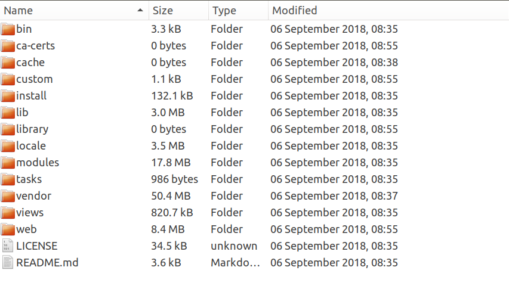
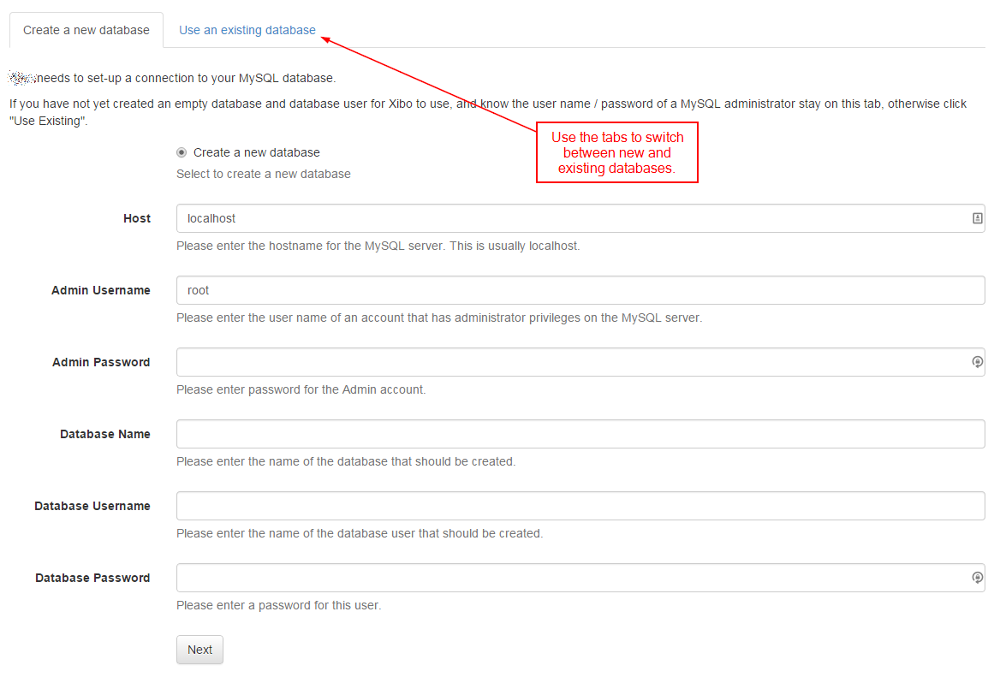
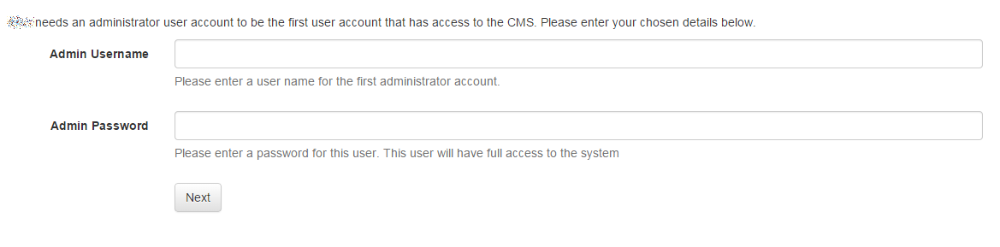
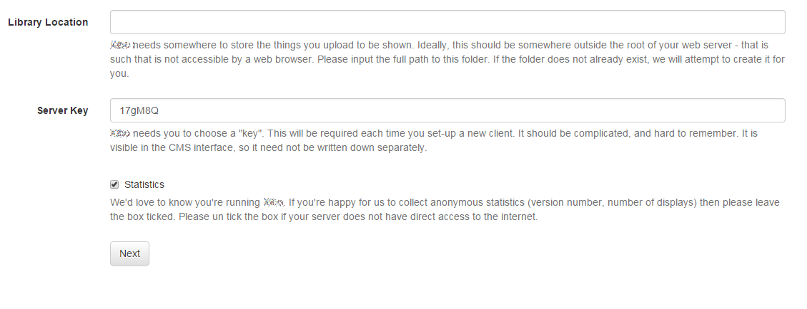
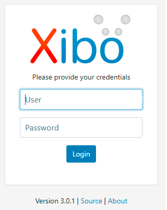
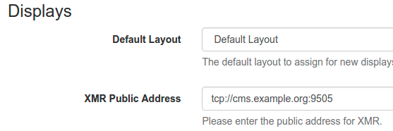

<!--toc=cms_install-->

# Apache/IISインストール

Dockerを使わずに[[PRODUCTNAME]]を手動/カスタムインストールするには、Webサーバーのインストール、設定、保守の方法について知識が必要です。

{tip}
[[PRODUCTNAME]]は、さまざまな環境、Webサーバー、ソフトウェアバージョンで動作させることができます。[[PRODUCTNAME]]チームが得意とする[サポートバージョンと環境](intro_version_environment.html)のリストがあります。このリスト以外の環境でのインストールを選択した場合、問題が発生した場合はコミュニティのサポートに頼ることになります。[ [[PRODUCTNAME]]コミュニティフォーラム](https://community.xibo.org.uk/)
{/tip}

## 最小要件

- MySQL 5.6
- ウェブサーバー（nginx、apache、iis)
- PHP 7.2.9+ (下記のPHPバージョンを参照)
- PHP-CLI 7.2.9+ (下記のPHPバージョンを参照)
- URLリライト
- バーチャルホストまたは専用Webサーバ（DocumentRootの変更）
- CRON/スケジュールタスク

### PHPのバージョン
- PHP 7.2.9以降が必要です。

### PHPモジュール。
- PHAR
- JSON
- GD
- DOM
- PDO
- PDO-MySQL
- Zip
- gettext
- Soap
- Curl
- Iconv
- Ctype
- File Info
- XML
- SimpleXML
- Mbstring
- zlib
- ZeroMQ

## 環境の準備
Dockerを使わずに動かすには、[[PRODUCTNAME]]が動作するように環境を設定する必要があります。ファイルをどこに置くか、どのウェブサーバーを動かすかなど、考慮すべきことがいくつかあります。

{tip}
このドキュメントでは、考えられるすべての環境に関する考察を網羅することはできませんが、以下のセクションで、よくある問題を取り上げます。
{/tip}

## CMSファイルの配置
CMSは安全な設計のため、ウェブサーバーが提供する場所にウェブフォルダーのみを置くことを意図したフォルダー構造になっています。つまり、ウェブサーバーやホスティングは、ファイルをウェブ以外の場所に配置することを許可しなければなりません。

これを実現するために、いくつかの戦略があります（これは完全なリストではありません）。

### 1. DocumentRoot を変更する
ドキュメントルートが`/var/www`の場合、CMSをそのフォルダにコピーし、ドキュメントルートを`/var/www/web`に変更します。

### 2. シンボリックリンクを使用する
ドキュメントルートが`/var/www`の場合、CMSを別のフォルダ（例えば`/home/user/xibo-cms`）にコピーし、`/home/user/xibo-cms/web`と`/var/www/web`の間にリンクを作成する。`home/user/xibo-cms/web` の所有者を www-data （または Web サーバが動作しているユーザ）に変更します。

###3.バーチャルホストの利用
バーチャルホストを利用することもできます。

```
<VirtualHost *:80>
    DocumentRoot "/var/www/web"
    ServerName www.example.com

    # Other directives here
    AllowOverride All
    Options Indexes FollowSymLinks MultiViews
    Order allow,deny
    Allow from all
    Require all granted
</VirtualHost>
```
リリースアーカイブの /web フォルダを指し、`.htaccess` ファイルを有効にする Virtual Host の設定であれば、どのような設定でもかまいません。

### 4. エイリアスを使用する
CMSはエイリアスで実行することができます。これはApacheの例です。

```
Alias /xibo "/home/user/xibo-cms/web"

<Directory "/home/user/xibo-cms/web">
    AllowOverride All
    Options Indexes FollowSymLinks MultiViews
    Order allow,deny
    Allow from all
    Require all granted
</Directory>
```

## URLリライト

CMSはURLの書き換えをサポートするウェブサーバー上で動作する必要があります。それができない場合は、URLに`index.php`を指定してアプリケーションにアクセスする必要があります。

## Apache

`.htaccess` ファイルが`web/.htaccess` に用意されています。このファイルは、CMSがウェブサーバのドキュメントルートまたはバーチャルホストから提供されていることを想定しています。

## エイリアスを使った書き換えルール

エイリアスが必要な場合は、エイリアスに一致する `RewriteBase` ディレクティブを含むように `.htaccess` ファイルを修正する必要があります。

例えば、エイリアスが `/xibo` である場合、`.htaccess` は `RewriteBase /xibo` になります。

## nginx

`nginx`の設定例を以下に示します。

```
RewriteBase /xibo .

nginx
A sample nginx config is provided below:

location / {
    try_files $uri /index.php?$args;
}

location /api/authorize {
    try_files $uri /api/authorize/index.php?args;
}

location /api {
    try_files $uri /api/index.php?$args;
}

location /install {
    try_files $uri /install/index.php?$args;
}

location /maint {
    try_files $uri /maint/index.php?$args;
}

location /maintenance {
    try_files $uri /index.php?$args;
}
```

## IIS

IISには、`.htaccess` から変換する機能があり、IISに適した設定が作成されます。しかし、エラーメッセージ `Error IIS MAP RewriteRule .* - [E=HTTP_AUTHORIZATION:%{HTTP:Authorization}]` を受信する場合があります。

このルールはIISと互換性がないため、削除することができます。

インポート後、`web.config` ファイルに以下の内容が挿入されます。

```
<system.webServer>
    <rewrite>
        <rules>
            <rule name="Imported Rule 1" stopProcessing="true">
                <match url="^" ignoreCase="false" />
                <conditions logicalGrouping="MatchAll">
                    <add input="{REQUEST_FILENAME}" matchType="IsFile" ignoreCase="false" negate="true" />
                    <add input="{URL}" pattern="^.*/authorize/.*$" ignoreCase="false" />
                </conditions>
                <action type="Rewrite" url="api/authorize/index.php" appendQueryString="true" />
            </rule>
            <rule name="Imported Rule 2" stopProcessing="true">
                <match url="^" ignoreCase="false" />
                <conditions logicalGrouping="MatchAll">
                    <add input="{REQUEST_FILENAME}" matchType="IsFile" ignoreCase="false" negate="true" />
                    <add input="{URL}" pattern="^.*/api/.*$" ignoreCase="false" />
                </conditions>
                <action type="Rewrite" url="api/index.php" appendQueryString="true" />
            </rule>
            <rule name="Imported Rule 3" stopProcessing="true">
                <match url="^" ignoreCase="false" />
                <conditions logicalGrouping="MatchAll">
                    <add input="{REQUEST_FILENAME}" matchType="IsFile" ignoreCase="false" negate="true" />
                    <add input="{URL}" pattern="^.*/install/.*$" ignoreCase="false" />
                </conditions>
                <action type="Rewrite" url="install/index.php" appendQueryString="true" />
            </rule>
            <rule name="Imported Rule 4" stopProcessing="true">
                <match url="^" ignoreCase="false" />
                <conditions logicalGrouping="MatchAll">
                    <add input="{REQUEST_FILENAME}" matchType="IsFile" ignoreCase="false" negate="true" />
                    <add input="{URL}" pattern="^.*/maint/.*$" ignoreCase="false" />
                </conditions>
                <action type="Rewrite" url="maint/index.php" appendQueryString="true" />
            </rule>
            <rule name="Imported Rule 5" stopProcessing="true">
                <match url="^" ignoreCase="false" />
                <conditions logicalGrouping="MatchAll">
                    <add input="{REQUEST_FILENAME}" matchType="IsFile" ignoreCase="false" negate="true" />
                </conditions>
                <action type="Rewrite" url="index.php" appendQueryString="true" />
            </rule>
        </rules>
    </rewrite>
</system.webServer>
```
## ZeroMQ

[`ZeroMQ`](https://zeromq.org/)は、[[PRODUCTNAME]]がCMSとプレーヤー間のプッシュメッセージングを管理するために使用する低レベルのライブラリです。この機能を実現するには、ZeroMQのPHPバインディングが必要です。**XMRはZeroMQがインストールされていないと動作しません**。

ZeroMQバインディングのインストールは複雑です。Ubuntu 14.04でのインストール例を掲載しました。

{tip}
簡単にインストールするために、弊社のDockerコンテナを使用することをお勧めします。
{/tip}

### PPAからZeroMQのコアとPHPバインディングをインストール

`apt-get` によるインストール。

```
sudo add-apt-repository ppa:chris-lea/zeromq
sudo add-apt-repository ppa:alexharrington/php-zmq
sudo apt-get update
sudo apt-get install php5-zmq
```

### ZeroMQ の PHP バインディングを手動でインストール

PPA から直接インストールできない場合は、以下のようにして zmq 拡張をインストールします。

`PECL` によるインストール。

```
sudo add-apt-repository ppa:chris-lea/zeromq
sudo apt-get install libzmq3 libzmq3-dev libzmq3-dbg pkg-config php5-dev build-essential php-pear
sudo pecl install zmq-beta
```

`php.ini` ファイルに `extension=zmq.so` ディレクティブを追加して、Web サーバを再起動します。

### リリースのダウンロード

最新のリリースは、[GitHub のリリースアーカイブページ](https://github.com/xibosignage/xibo-cms/releases)からダウンロードすることができます。


## インストール
この先は、PHPとMySQLが動作するWebサーバーがあり、CMSインストールパッケージの圧縮アーカイブ（ZIPまたはTarball）がサーバーに転送されていることが前提になります。

インストール作業の流れです。

- アーカイブのダウンロードと解凍
- インストールを開始する
- 前提条件
- データベースの作成
- データベースの詳細
- インストールを開始する
- 最終設定
- XMRのインストール
- XTRの設定
- 完了

### アーカイブのダウンロードと解凍
CMSアーカイブにはXibo-cms-(version)というサブフォルダがありますので、このフォルダの内容をWebサーバーの適切な場所にコピーしてください。このフォルダはウェブサーバ以外の場所に解凍することを**強くお勧め**します。専用サーバーの場合、`DocumentRoot` は`/path/to/Xibo-folder/web`を指す必要があります。

{tip}
その他の設定については、このページの「環境を整える」の項で説明します。
{/tip}

解凍されたアーカイブは、以下の画面のようになっているはずです。



**Library**用のフォルダが用意されており、画像や動画などのファイルを保存することができます。このフォルダは、他の場所に移動したり、インストール中に変更することができます。

### インストールの開始

- `http://localhost` にアクセスすると、自動的にインストールが開始されます。
インストールはウィザード形式で行われ、インストーラーが[[PRODUCTNAME]]のインストール手順を案内します。

### 前提条件
インストーラーには、インストールを成功させるために必要なすべての項目の詳細なチェックリストが含まれています。各項目には、以下のいずれかが表示されます。

- チェックマーク - その項目が存在し、正しい
- エクスクラメーションマーク - 項目が存在するが、正しく設定されていない可能性がある。
- 十字 - その項目がありません。

感嘆符や×印のついた項目は、対処し、再テストボタンでこのステップを再度実行する必要があります。

{tip}
ここで最も一般的な問題は、PHPモジュールの欠落、PHP設定の構成、ライブラリへのファイルパーミッションの問題です。
{/tip}

すべての項目にチェックを入れたら、**Next**を押して先に進みます。

### データベースの作成
CMSは、新しいデータベースまたは既存のデータベースにインストールすることができます。

{tip}
新規データベースをお勧めします。
[[PRODUCTNAME]]はテーブル名に接頭辞を付けないので、既存のデータベースのコンテンツと衝突する可能性があります。
{/tip}

新規データベースか既存データベースかの選択は、利用可能な2つのタブを切り替えることで行うことができます。



### データベースの詳細
既存のデータベースを選択した場合でも、新しいデータベースを選択した場合でも、インストーラは、CMSが接続、読み取り、書き込みできるようにするために、そのデータベースに関するいくつかの情報を収集する必要があります。

インストーラは、以下の情報を必要とします。

- **ホスト** - MySQLのホスト名 - ほとんどの場合、"localhost"となります。
- **管理者ユーザー名** - MySQLの "ルート"ユーザー名。これはインストール時にのみ使用され、インストーラーに新しいデータベースを作成するよう依頼した場合のみ必要です。
- **管理者パスワード**  - "ルート"パスワード。これはインストール時にのみ使用され、インストーラに新しいデータベースを作成するよう依頼した場合にのみ必要です。
- **データベース名** - CMSデータベースの名前です。
- **データベース・ユーザー名** - CMSがデータベースに接続する際に使用するユーザー名です。
- **データベースパスワード** - データベースへの接続に使用するパスワードです。

### インストールを開始する

インストーラは、Xibo用のデータベースを作成します。

このとき、画面上に一連のドットが表示されるはずです。インストールが完了するまで、しばらく時間がかかることがあります。

- すべてがうまくいったとしたら、**Next** をクリックします。

### 管理者パスワード

各インストールには、システムの管理、アップグレードの適用、高度な設定を行うために、少なくとも1人の**スーパーユーザー**レベルの管理者が必要です。

インストーラは、ステップ3でこのユーザーの作成を促します。



**このユーザー名とパスワードは、インストールが完了したときに必要になりますので、大切に保管してください。**

### 設定

次の画面では、[[PRODUCTNAME]]の設定を行います。



- 最初のフィールドは、[[PRODUCTNAME]]がアップロードしたメディアを保存する**Library Location**を尋ねます。リリースアーカイブには、このためのフォルダ `/library` が含まれていますが、他のフォルダを使用することもできます。このフォルダをここに入力します（例： `/var/www/Xibo/library` ）。
- 次のフィールドは、CMSとディスプレイを認証するために使用される**CMSキー**を要求しています。
- 最後のチェックボックスは、匿名の統計情報を[[PRODUCTNAME]]プロジェクトに送り返してもよいかどうかを尋ねるものです。送信していただけると幸いです。

### 完了

これでインストールが完了し、システムにログインできるようになりました。



## XTR - ルーチンタスク

XTRは、[[PRODUCTNAME]]のタスクスケジューラーで、CMS上で**ルーチンタスク**を実行するためのものです。典型的なタスクは、メンテナンス、メールアラート、アーカイブ、サードパーティーの統合などです。

タスクはphpスクリプトで実行され、CRON、タスクスケジューラ、またはOSの同等のシステムで実行するようスケジュールされます。

### 前提条件

CMSがインストールされているOSは、タスクスケジューラがあり、PHPコマンドライン（CLI）にアクセスできる必要があります。

さらに、電子メールによる通知を行うには、PHP CLI で mail() コマンドが動作する必要があります。ローカルあるいはリモートの SMTP サーバー経由でメールを送信するように PHP が設定されていることを確認する必要があります。

タスクは最大限の効率を得るために並列に実行されるので、システムは [pcnt_fork](https://www.php.net/manual/en/function.pcntl-fork.php) をサポートしている必要があります。

### 設定
このセクションは、ここで入手できるMoodle Cronドキュメントに大まかに基づいています。ほとんどのunixベースのサーバはcronのバージョンを実行します。Cronはスケジュールでコマンドを実行します。

最近のLinuxディストリビューションは、/etc/crontabから設定を読み取るバージョンのクーロンを使用します。etc/crontabがあれば、それを好きなエディターで編集します。そうでなければ、以下を実行してcrontabを編集します。

```
crontab -e
```

を実行して、以下を追加します。

```
* * * * * /usr/bin/php /var/www/xibo/bin/xtr.php
```

最初の5つのエントリは、値を実行する時間であり、その後に実行するコマンドを記述します。アスタリスクはワイルドカードであり、任意の時間を示します。

**重要**なのは、`xtr.php`ファイルは、Webサーバーが実行されているユーザーアカウントとファイルを共有できるユーザーによって実行されなければならないということです。`crontab -e`を実行する場合、'said user'として実行する必要があり、`/etc/crontab`を編集する場合、タスクでユーザーを指定することができます。

```
* * * * * www-data /usr/bin/php /var/www/xibo/bin/xtr.php
```

これは、XTRがキャッシュされたファイルを更新する可能性があるためです。

オンラインで利用できるCRONのリソースがあるので、それを利用すると便利かもしれません。

- [基本的なcrontabのチュートリアル](http://www.linuxweblog.com/crotab-tutorial)
- [マニアルページのオンライン版](https://www.freebsd.org/cgi/man.cgi?query=crontab&amp;apropos=0&amp;sektion=5&amp;manpath=FreeBSD+6.0-RELEASE+and+Ports&amp;format=html)

**初心者の方**は、「EDITOR=nano crontab -e」とすると、nanoエディタを使ってcrontabを編集することができます。Ubuntuのデフォルトでは、nanoエディタを使用します。

通常、「crontab -e」コマンドを実行すると、「vi」エディタに入ります。i」を押して「挿入モード」に入り、上記のような行を入力し、「ESC」を押して挿入モードを終了します。保存して終了するには、":wq" と入力するか、保存せずに終了するには ":q!" (引用符なし) を使用します。(引用符なし)で保存せずに終了します。vi」エディタの紹介はこちらです。

## Windowsのスケジュールタスク
このセクションは、[ここ](https://docs.moodle.org/400/en/Cron#Managing_Cron_on_Windows_systems)にあるMoodle Cronドキュメントに広く基づいています。

- あなたのサーバでphp.exeまたはphp-win.exeプログラムを見つけてください。これは、あなたのPHPインストールディレクトリにあるはずです。
- スケジュールタスクのセットアップ
- スタート -> コントロールパネル -> スケジュールされたタスク -> スケジュールされたタスクの追加に移動してください。
- **Next**をクリックし、ウィザードを開始します。
- **Browse…**ボタンをクリックし、php.exeまたはphp-win.exeを参照し、**OPEN**をクリックします。
- タスクの名前に**[[PRODUCTNAME]] Maintenance**入力し、スケジュールとして**Daily**選択します。**Next**をクリックします。
- 開始時間として12:00 AMを選択し、タスクを毎日実行し、開始日として本日の日付を選択します。**Next**をクリック
- タスクが実行されるユーザーの**ユーザー名**と**パスワード**を入力します（特権アカウントである必要は全くありません）。パスワードが正しく入力されていることを確認してください。**Next**をクリックします。
- **Open advanced properties for this task when I click Finish** というタイトルのチェックボックスをマークし、**Finish**をクリックします。
- 新しいダイアログボックスで、**Run:**テキストボックスに次のように入力します。

```
c:\php-win.exe -f c:\pathtoXibo¥scripts.php
```

Protected Modeで実行している場合は、secretをMaintenance Keyに置き換えてください。

- **Scheduleタブ**をクリックし、**Advanced...**ボタンをクリックします。
- **Repeat task**にチェックを入れ、**Every:**を1分に、**Until:**を**Duration**に設定し、**23**時間**59**分と入力する
- **OK**をクリックします。
- **スケジュールされたタスクのテスト**

スケジュールされたタスクが正常に実行されるかどうか、右ボタンでクリックし、**Run**を選択することでテストすることができます。すべてが正しく設定されている場合、phpが実行され、cronpageを取得する間、DOSコマンドウィンドウが一時的に表示され、その後、表示されなくなります。スケジュールタスクフォルダーを更新すると、フォルダー詳細表示の「最終実行時間」列が現在の時刻を反映し、「最終結果」列が「0x0」（すべて問題なし）と表示されていることが確認できます。このどちらかが異なる場合は、設定を再確認してください。

## CRON / Scheduled Tasksの実行に問題がある場合は？

CRONを実行できないユーザーは、タスクを実行することができませんが、このような場合でもメンテナンスを実行することが重要です。

このため、`http://<host>/maint?key=changeme`のWebアドレスからメンテナンスルートにアクセスすることができます。

このキーは、CMSのメインメニューの**管理セクション**にある**メンテナンス**タブの**設定**ページで設定します。

- メンテナンスの有効化？
- メンテナンスキー

このキーは、「メンテナンスの有効化」を**保護**に設定した場合に必要となります（強くお勧めします）。詳しくは、「メンテナンス」セクションをご覧ください。

## XMR - プッシュ型メッセージング
XMRとは、Xibo Message Relayの略で、CMSからプレーヤーにメッセージをプッシュする役割を担っています。XMRは、プレーヤーが即座にアクションを起こす必要がある場合に使用されます。

### Mile-highの概要
XMRはメッセージキューイングアプリケーションで、CMS -> XMRの通信と、XMR -> プレーヤーの通信の2つの部分から成ります。したがって、2つのポートでリッスンする必要があります。

CMS -> XMRセクションはリクエスト/レスポンスキューで、XMR -> Playerセクションはパブリッシャー/サブスクライバーキューです。

{tip}
通信プロトコルは問いませんが、TCPを推奨します。
{/tip}

### インストール方法

**ZeroMQ**がインストールされ、有効になっていることを確認してください。

XMRはCMSのインストール先の`vendor/bin`フォルダに含まれており、使用する前にそのフォルダに`config.json`ファイルを書き込むことが必要です。

config.jsonは非常にシンプルです。

```
{
  "listenOn": "tcp://localhost:50001",
  "pubOn": ["tcp://your_ip:9505"],
  "debug": false
}
```

- `listenOn` は CMS -> XMR 通信のための XMR Private Address です。
- `pubOn` は、XMR -> プレーヤー通信のXMR Public Addressです。
- `debug` は、デバッグメッセージの出力レベルと、コンソールに出力するかどうかを決定します (false = no)

XMRはPHAR（PHPアーカイブ）であり、どのターミナルからでも`php xmr.phar`を発行することで実行できます。これは長時間稼働するアプリケーションであり、一度起動すると終了しません。サービスとして実行することをお勧めします。`vendor/xibosignage/xibo-xmr/bin/upstart`にupstart confファイルの例があります。

## CMS の設定

プレーヤーアクションが必要な場合、CMS は XMR インスタンスと通信するように設定する必要があります。

CMS は、メイン CMS メニューの**管理**セクションにある**設定**ページの**ディスプレイ**タブで設定できます。設定項目は2つあります。

- **XMR Private Address** - CMS -> XMRの通信に使用する`ListenOn`アドレスです。
- **XMR Public Address** - XMR -> プレーヤー通信の`pubOn`アドレスです。

CMSのXMR public addressを調整します。

- CMSメインメニューの**管理**セクションにある**設定**ページに移動し、**ディスプレイ**タブを選択します。



XMRパブリックアドレスのデフォルトは`tcp://cms.example.org:9505`ですが、お使いのネットワークに合うように調整する必要があります。

- アドレスの形式は次のようにする必要があります。

```
tcp://<IP_address>:<port>のようになります。
```

- デフォルトの`<port>`は9505で、docker-composeの設定でカスタムポートを指定していない限り、この値に設定する必要があります。

CMS が DNS 名で利用できる場合 - たとえば CMS のウェブページが https://mydomain.com にある場合、`cms.example.org` を `mydomain.com` に置き換えるだけでよいでしょう。CMSがIPアドレスによってのみ利用可能な場合は、代わりにIPアドレスを入力してください。

{tip}
CMSサーバーでローカルファイアウォールを使用している場合、XMRが動作するためにポート9505とウェブインターフェースのポート80/443の受信を許可する必要があります。
{/tip}


## セキュリティ

XMRは暗号化されたメッセージのみを扱います。

プレーヤーはCMSに登録する際、公開鍵と秘密鍵を生成し、公開鍵をCMSに送信します。XMRを経由するすべてのメッセージは、送信先のディスプレイの公開鍵を用いて暗号化されます。これはCMSで行われるため、XMRは暗号化されたメッセージのみを受信します。

CMS -> XMR `listenOn`アドレスは、内部ネットワークに対してプライベートであるべきです。

{tip}
CMSとXMRは同じマシンで動作させるのが一般的です。
{/tip}

## 複数のCMSインストレーション

XMRは**複数のCMS**に対応しています。メッセージの暗号化により、意図した受信者だけがメッセージを読むことができるため、CMSに依存しません。

## CMS/データベースのバックアップ
Xibo CMSのファイルやライブラリをバックアップし、mysqldumpなどを使ってデータベースのダンプを作成する必要があります。

定期的なバックアップをどのように行うかは、各管理者の判断に委ねられています。

[duplicati](https://www.duplicati.com/) - Windows/Linux duplicity GUI バックアップアプリケーション

[duply](http://duply.net/Duply_(simple_duplicity)) - Linux duplicity コマンドラインバックアップアプリケーション。

{tip}
バックアップが信頼でき、効果的であるためには、自動化されなければならないことを忘れないでください。手動で定期的にバックアップを取ることを忘れないでください。
{/tip}

## ライブラリと帯域の制限
ライブラリファイルのサイズと月間の帯域幅使用量の制限を管理します。

- これは、データベース・テーブルの2つの設定（LIBRARY_SIZE_LIMIT_KB & MONTHLY_XMDS_TRANSFER_LIMIT_KB ）によって行われます。

データベースに制限が入力されていない場合は、すべて無制限に動作しますが、制限が入力されると、Xiboはこれらの制限に対する検証を開始し、制限を超えるとプレーヤーへの新しいメディアや更新のアップロードを阻止するようになります。

ただし、この2つの設定は、現在のところユーザーインターフェースからは利用できず、統計データのみが表示されます。

{tip}
ディスプレイが消費できる帯域幅の制限を適用することもできます。
{/tip}


## コミュニティリソース

- Ubuntu 16:04のDocker
- Synology DSM6+でDockerを使用
- IIS 8.5、Windows Server 2012でDockerを使用しない場合
- CentOS 7での非Docker
