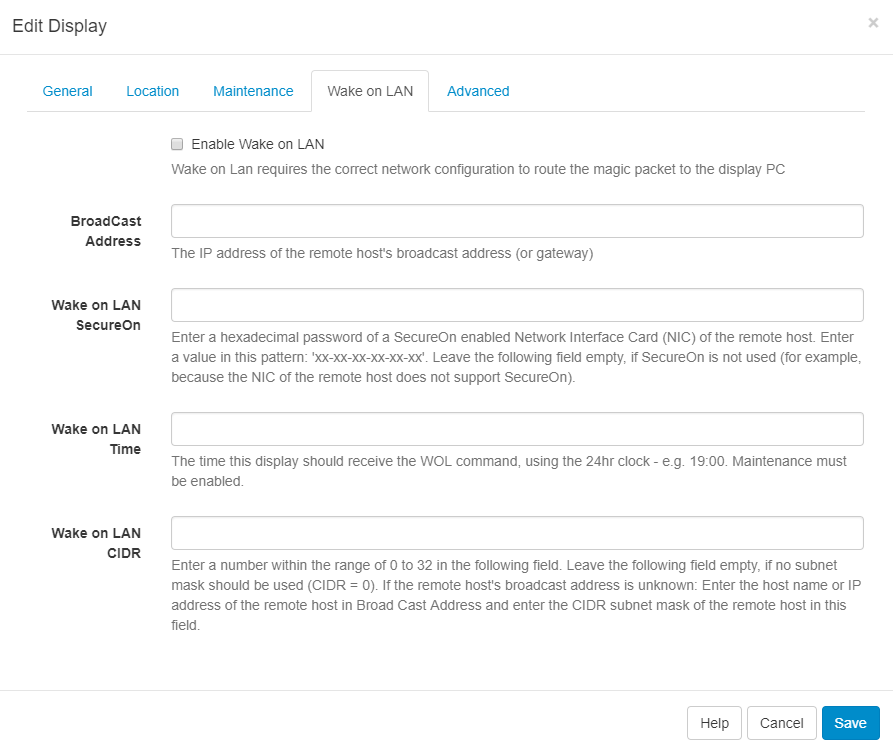

<!--toc=cms_config-->

# Wake on LAN設定

[[PRODUCTNAME]]は、サイネージプレーヤーのハードウェアが **Wake on LAN** をサポートし、サイネージプレーヤーがCMSによってアドレス指定可能である場合に、Wake on LANをサポートします。この場合の「アドレス指定可能」とは、CMSとプレーヤーハードウェアの間に明確なネットワーク経路があることを意味します。

ハードウェアとネットワークがWake on LANに対応していることを前提に、CMSの**ディスプレイ編集フォーム**を使って設定します。

- CMSのメインメニューから**ディスプレイ**をクリックします。
- 選択した**ディスプレイ**の行メニューを使用し、**編集**を選択します。
- **Wake on LAN**タブを使用して設定します。

{tip}
ディスプレイの行メニューで**Wake on LAN**を選択すると、テスト用に即座にWOLメッセージを**ディスプレイ**に送信することができます。
{/tip}

注意: 時限式WOLメッセージを送信するには、[メンテナンスモジュール](cms-maintenance.html)が正しく設定されている必要があります。

{tip}
**スケジュールされたタスク**や[シェルコマンド](/manual/ja/displays_command_functionality.html)など、プレーヤーをスリープさせるためのいくつかの異なるオプションがあります。
{/tip}

