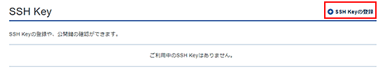
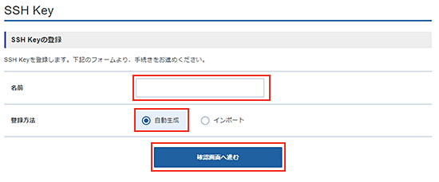
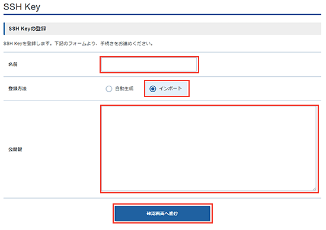

<!--toc=setup_server-->

# SSHでの接続を行う

秘密鍵で接続するために必要な作業は、基本的には以下の手順となります。

1. ssh-keygen コマンドで公開鍵・秘密鍵のペアを作る
1. サーバー側に公開鍵を置く
1. クライアント側 に秘密鍵を設置する
1. クライアント側から秘密鍵を使って接続する

## 公開鍵・秘密鍵のペアを作る

### 公開鍵・秘密鍵の自動生成

Xserver VPSではVPSパネルから、公開鍵・秘密鍵のペアを作成することができます。
VPSパネルのSSH Keyをクリックすると、SSH Key画面が表示されます。



この画面で、SSH Keyの登録をクリックすると、登録画面が表示されます。



自動生成を選択すれば、rootに公開鍵が設定され、秘密鍵のダウンロードができます。
ダウンロードした秘密鍵ファイル（xxxxx.pem)はクライアントに設定するので、決して無くさないでください。

### 公開鍵・秘密鍵のインポート

別途用意したSSH Keyをインポートすることも可能です。



インポートを選択し、別途生成した公開鍵を入力してください。

公開鍵・秘密鍵は以下のコマンドで生成することができます。

```
$ ssh-keygen 
Generating public/private rsa key pair.
Enter file in which to save the key (/Users/ユーザー名/.ssh/id_rsa): <--鍵の保存先 
Enter passphrase (empty for no passphrase):  <-- パスフレーズを入力（任意）
Enter same passphrase again:  <-- もう一度、パスフレーズを入力（任意）
Your identification has been saved in id_rsa.
Your public key has been saved in id_rsa.pub.
```

## サーバー側に公開鍵を置く

VPSパネルから公開鍵を登録していれば、rootのホームディレクトリに`.ssh`ディレクトリが作成され、その下に`authorized_keys`ファイルが作られているはずです。

対象サーバーのユーザーへ初めて鍵登録する際は、パーミッションの設定が必要になります。
とりあえず、フォルダとファイルを作ります。

```
mkdir .ssh
touch .ssh/authorized_keys
chmod 700 .ssh
chmod 600 .ssh/authorized_keys
```

この後、公開鍵をサーバーへ持って行ってauthorized_keysへ追記する必要があります。

## クライアント側 に秘密鍵を設置する

クライアントはSSHに対応したターミナルソフトを使います。

- Windwosの場合は**teraTerm**、**PuTTY**
- MacOSの場合は標準搭載の**Terminal**

がお勧めです。

先にダウンロードした秘密鍵を指定して、サーバーに接続してみましょう。

書式は:

```
ssh [オプション] ホスト名 [コマンド]
```

です。オプションで`-i 秘密鍵ファイル`と、`-l ユーザー名` 指定すれば接続ができます。

```
$ ssh -i sampla.pem -l root sample.com
```

## クライアントから簡単に接続する

詳しくはteraTerm、PuTTY、MAC-Terminalなどの解説を参照してください。

例として、MAC-Terminaでの設定を紹介します。

MACに`~/.ssh/config`ファイルを作成し、接続先情報を設定します。

```
Host signage
    HostName sample.static.xvps.ne.jp
    User UserName
    IdentityFile ~/.ssh/Signage.pem
    Port  22
    TCPKeepAlive yes
    IdentitiesOnly yes
```

このように設定すれば、

```
ssh signage
```

と入力するだけで、サーバーに接続されます。

{tip}
SSHで直接rootに接続することは、セキュリティ上好ましくありません。基本的には一般ユーザー権限でサーバーに接続し、`su root` もしくは`sudo`によってroot権限を獲得する設定をしてください。
詳しい解説はここでは行いませんが、Linux関連の情報を参考にして、環境を設定してください。
{/tip}

## rootでのSSHログインを禁止する

これまでの手順で、SSHでユーザーがログインできるようになったなら、rootでのSSHログインを禁止しておきましょう。
rootでのSSHログインを禁止するために、SSHの設定ファイル`/etc/ssh/sshd_config`を編集します。まずは、SSHサーバーに一般ユーザーでSSH接続しましょう。

/etc/ssh/sshd_configのrootログインの可否を決めるPermitRootLogin項目を編集します（yesにすれば、rootのログインを許可、noにすれば、rootを許可しません）。

```
# vi /etc/ssh/sshd_config

#LoginGraceTime 2m
#PermitRootLogin yes → PermitRootLogin no に変更
#StrictModes yes
```

### SSHの設定を反映
適切に編集されていることを確認したら、SSHの設定を反映します。

```
# systemctl restart sshd.service
```

