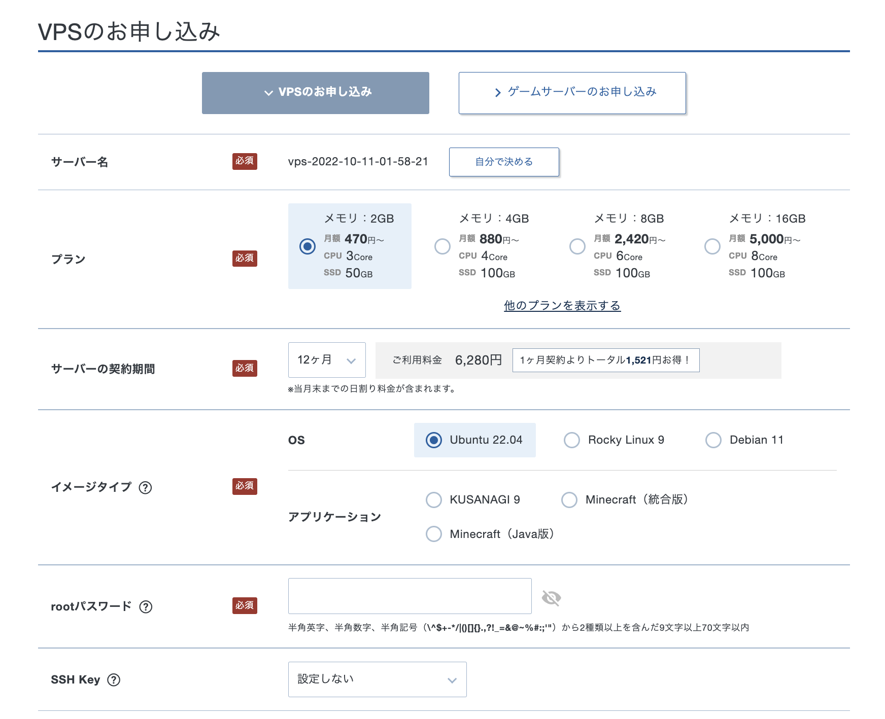
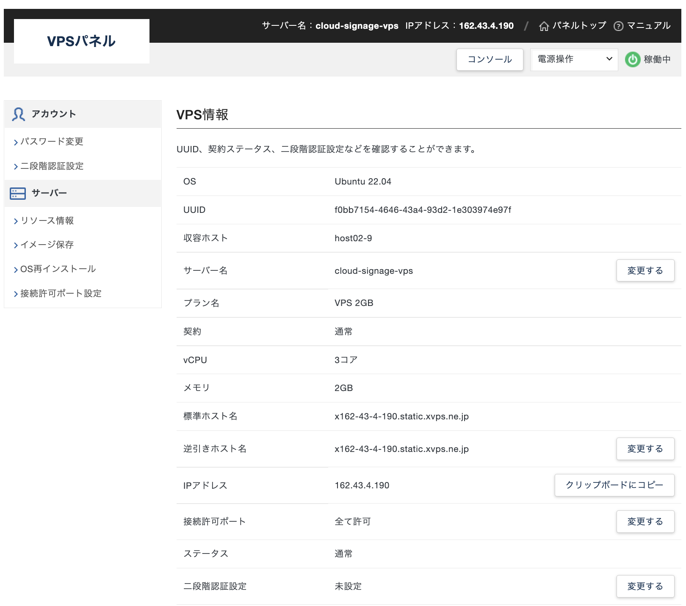

<!--toc=setup_server-->
 
# サーバーを準備する

[[PRODUCTNAME]] CMSを利用する場合は、システムを稼働させるサーバーを準備する必要があります。

Web用のレンタルサーバーでもインストールすることができますが、root権限がないため何かと不都合が生じます。
また、XMR(Xibo Message Relay)など、対話型アクションを実現するためには、phpの拡張機能(zeroMQ.so)をインストールする必要があり、root権限がないと実装できない場合があります。

更に、推奨されているDockerでのインストールは、ほとんどのレンタルサーバーでは対応していないため使えません。

ご自身で、サーバーを用意するか、VPS(Vertsual Private Server)をご利用いただくことをお勧め致します。

ここでは比較的安価な[Xserver社のVPS](https://vps.xserver.ne.jp/)を例に取って解説します。

> すでにサーバーをお持ちの方は本章を読み飛ばしてください。 また、ここで紹介している以外のサーバーを利用する方は、それぞれのサーバーの手順に従ってください。

## サーバーの契約

以下がXserver社のVPSの申し込み画面です。

ご利用になるベンダーにより手順は異なりますが、最低メモリ2G、ストレージ20Gが推奨されます。複数のCMSを同一サーバーで動かす場合や、多くのディスプレイを接続する場合は、それ以上のプランをお選びください。

- **サーバー名**は自由に設定できます。
- **イメージ**はUbuntu 22.04をセンタクしてください。
- **rootパスワード**は忘れないように注意してください。
- **SSH Key**は後からでも設定できますが、ここで設定すればrootに公開鍵が設定され、秘密鍵がダウンロードできます。ダウンロードした秘密鍵はSSH接続で必要ですので、無くさないように保存してください。

