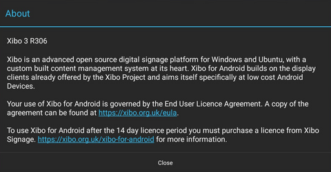

<!--toc=android_install-->

# Xibo for Androidの動作について

Xibo for Androidは、24時間365日、ユーザーからの追加入力なしに動作するように設計されています。そのため、アクションバーやナビゲーションバーなど、ユーザーにとって重要でないナビゲーションコントロールは極力表示されないようにしています。ほとんどの場合、Xibo for Androidと対話する必要がないことを期待しています。

万が一、動作状況の確認や設定変更など、対話が必要な状況になった場合は、タッチやカーソル操作でアクションバーやナビゲーションバーが表示されます。

## メニュー

Xibo for Androidは、すべてのAndroidユーザーになじみのあるメニューシステムを採用しています。メニューは、ディスプレイの右上にある**3 stacked dots**でアクセスできます。

最も一般的なメニュー項目は、デフォルトで公開されています。

- **Hide** アクションバーをすぐに隠します（非表示の遅延時間を待たないでください）。
- **Status** ステータス ステータスダイアログにアクセスします。
- **Settings** 設定 設定ページにアクセスします。
- **Check Licence** ライセンスチェック ソフトウェアのライセンスを手動で確認します。
- **About**  About ウィンドウを表示します。

## ステータスウィンドウ

ステータスウィンドウは、プレーヤーが何をしているかをリアルタイムに確認するために使用されます。主な用途は、Xibo for Androidが予期しない動作をしたときのトラブルシューティングです。

{tip}
サポートを依頼した場合、サポート担当者はこのステータスウィンドウのスクリーンショットを要求してくる可能性があります。
{/tip}

表示される情報は、4つのエリアに分かれています。

## 一般情報

このセクションには、一般的な設定情報が含まれており、設定が正しいかどうかを確認することができます。特に、**Licensed** と **Registered** Status は重要です。

- **Licensed** このフラグは、ソフトウェアが現在ライセンスされているかどうかを示しています。設定可能な値は「true（試用版）、true（フル版）、false（偽）」です。ディスプレイがライセンスされていない場合、接続されているCMSから新しいコンテンツをダウンロードすることができなくなります。

- **Registered** このフラグは、ディスプレイが接続されているCMSに登録されているかどうかを示します。登録されていない場合、ディスプレイは新しいコンテンツやスケジュールをダウンロードすることができません。

## CMSステータス

CMSステータスは、CMSとの最後の通信結果をリストアップします。収集間隔（初期値5分）ごとに3つのメッセージが転送されますが、3つともエラーにならないようにしてください。

## スケジュール状況

端末の現在のスケジュールと各レイアウトの状態が表示されます。

**All Layouts** ダウンロードされているが、必ずしも現在スケジュールされていないレイアウト（例えば、デフォルトのレイアウトはダウンロードされますが、他にスケジュールされているレイアウトがある場合は表示されないことがあります）。

**Scheduled Layouts** 現在スケジュールされているレイアウトがリストアップされます。

**Valid Layouts** リソースがすべてダウンロードされると、レイアウトは有効になりま す。

**Invalid Layouts** リソースが不足しているレイアウトやブラックリストに載っているレイアウ トは無効となり、スケジュールから削除されます。

**Blacklist** メディアアイテムのダウンロードに成功し、Xiboが再生すべきと考えるが再生されない場合、状況によっては一時的にブラックリストに登録されます。例えば、サポートされていないコーデックを持つビデオなどがその例です。

**Log Messages** Xibo for Androidは、最近記録された5つのログメッセージをリストアップします。

{tip}
この情報は、トラブルシューティングの際にサポート担当者から要求されることがあります。
{/tip}

## About Window

アプリケーションのバージョンとEULAが表示されます。

## Xiboを終了する

Xibo for Androidアプリケーションを終了するには、ナビゲーションバーの「ホーム」ボタンを使ってください。
