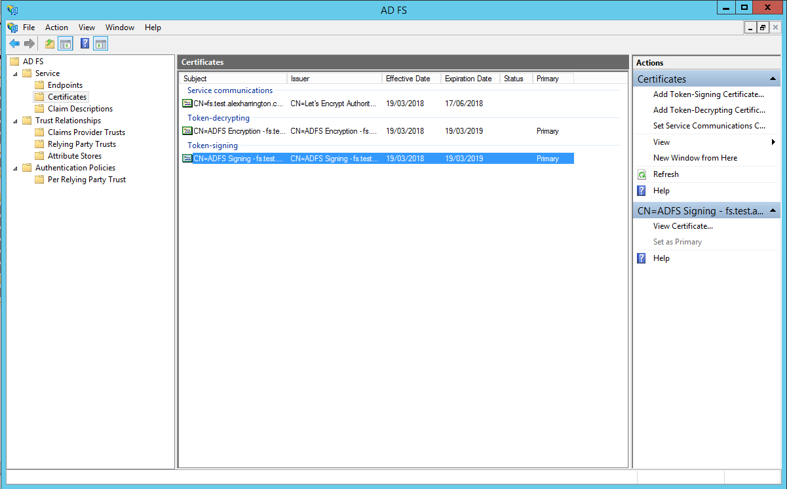
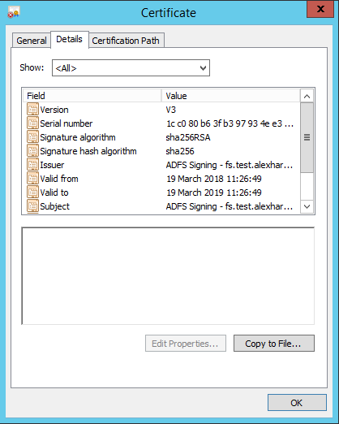
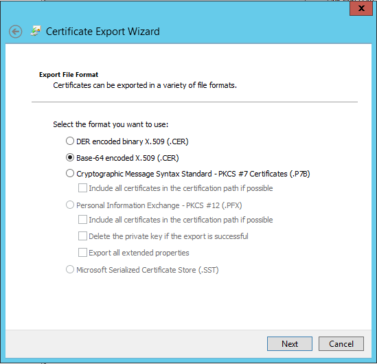
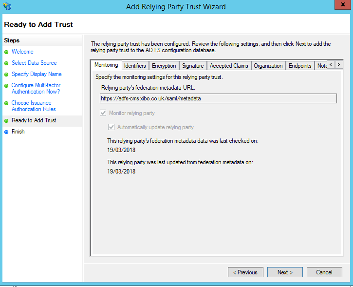
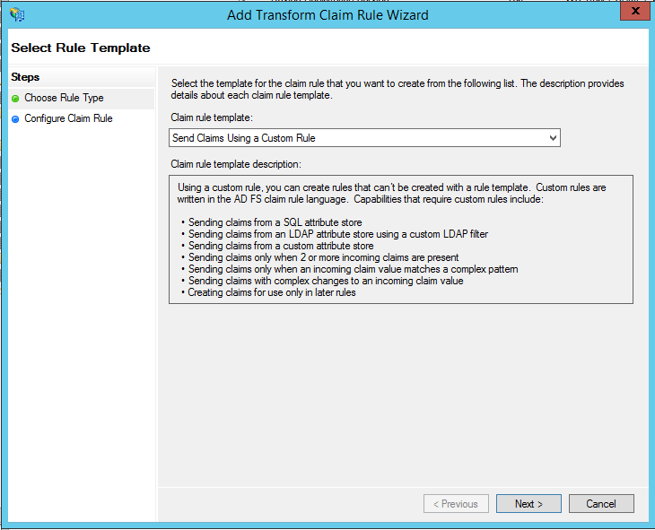
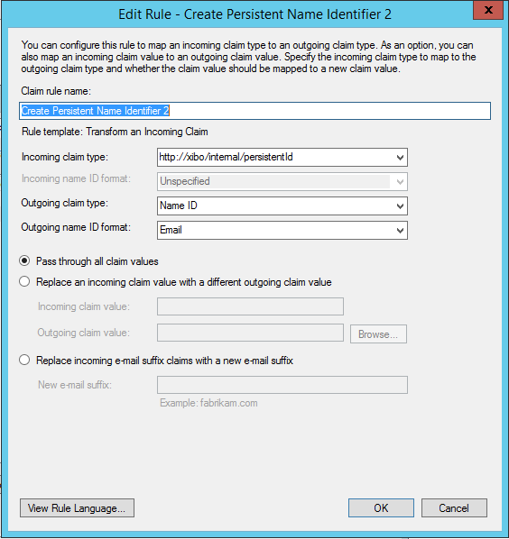
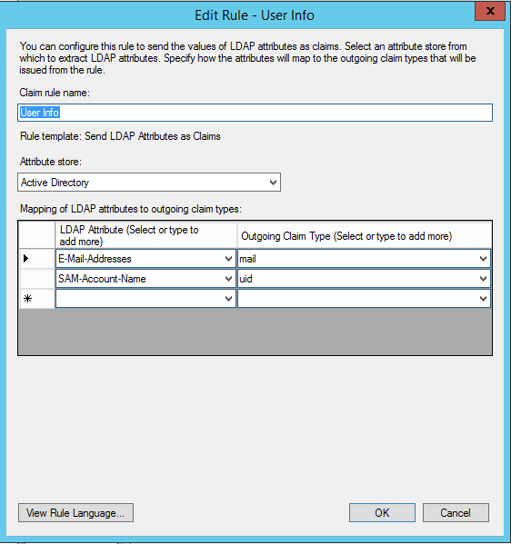

<!--toc=cms_config-->

# Active DirectoryによるSAMLシングルサインオン - ADFS
[[PRODUCTNAME]]は、SAML 2.0 IdPに対して認証するように設定することができます。Microsoft Active Directory Federation Servicesは、このようなIdPとして機能するように設定することができます。

- サーバーにADFSのロールをインストールします。

IdP を公開する予定の URL に対して、有効な SSL 証明書が必要である。この例では、`https://fs.test.alexharrington.co.uk` でIdPを公開しています。この記事が公開される頃には、このIdPは存在しないでしょう。同様に、Xibo CMSも有効なSSL証明書で保護されたサーバーでホストされている必要があります。


IdPをインストールしたら、Xibo CMSサーバーと、ユーザーが認証に使用するクライアントコンピューターの両方から、設定したURLのIdPウェブページにアクセスできることを確認します。

{tip}
例えば、https://fs.test.alexharrington.co.uk/adfs/ls/ にアクセスすると、ADFS が提供する Web ページが表示され、エラーが発生するはずです。これは正常です。ここでは、接続性を確認しているだけです。
{/tip}

まず、ADFSから署名証明書をエクスポートする必要があります。

- ADFSコンソールを開き、`Service > Certificates`に移動し、`Token-signing certificate`を見つけます。



- 右クリックし、`証明書の表示`を選択します。

- `詳細`に移動し、`ファイルにコピー...`をクリックします。



- `Base-64 encoded X.509`形式を選択し、ファイルを適当な場所に保存してください。



[[PRODUCTNAME]] CMS の `settings.php` または `settings-custom.php` ファイルを編集し、以下の SAML 設定例を追加してください。

```
$authentication = new \Xibo\Middleware\SAMLAuthentication();

$samlSettings = array (
   'workflow' => array(
        // Enable/Disable Just-In-Time provisioning
        'jit' => true,
        // Attribute to identify the user 
        'field_to_identify' => 'email',   // Alternatives: UserID, UserName or email
        // Default libraryQuota assigned to the created user by JIT
        'libraryQuota' => 1000,
        // Initial User Group
        'group' => 'Users',
        // Home Page
        'homePage' => 'icondashboard.view',
        // Enable/Disable Single Logout
        'slo' => false,
        // Attribute mapping between XIBO-CMS and the IdP
        'mapping' => array (
            'UserID' => '',
            'usertypeid' => '',
            'UserName' => 'uid',
            'email' => 'mail',
        )
    ),
   // Settings for the PHP-SAML toolkit. 
   // See documentation: https://github.com/onelogin/php-saml#settings 
   'strict' => false,
   'debug' => true,
   'idp' => array (
            'entityId' => 'https://<yourcms>/saml/acs',
            'singleSignOnService' => array (
                'url' => 'https://<yourIdP>/adfs/ls',
            ),
            'singleLogoutService' => array (
                'url' => 'http://idp.example.com/simplesaml/saml2/idp/SingleLogoutService.php',
            ),
            'x509cert' => '<yourCert>',
        ),
   'sp' => array (
        'entityId' => 'https://<yourCMS>/saml/acs',
        'assertionConsumerService' => array (
            'url' => 'https://<yourCMS>/saml/acs',
        ),
        'singleLogoutService' => array (
            'url' => 'https://<yourCMS>/saml/sls',
        ),
        'NameIDFormat' => 'urn:oasis:names:tc:SAML:1.1:nameid-format:emailAddress',
        'x509cert' => '',
        'privateKey' > '',
    ),
    'security' => array (
        'nameIdEncrypted' => false,
        'authnRequestsSigned' => false,
        'logoutRequestSigned' => false,
        'logoutResponseSigned' => false,
        'signMetadata' => false,
        'wantMessagesSigned' => false,
        'wantAssertionsSigned' => false,
        'wantAssertionsEncrypted' => false,
        'wantNameIdEncrypted' => false,
    )
);
```

必ず置き換えてください。

- `<yourIdP>` はADFSサーバーのURLです。
- `<yourCMS>` は、[[PRODUCTNAME]] CMS の URL に置き換えてください。
- `<yourCert>` はADFSからエクスポートした証明書のテキストで、`-----BEGIN CERTIFICATE-----` と `-----END CERTIFICATE-----` の行を除いて1行で記述してください。

ファイルを保存すると、ログインする際にCMSがSAML IdPにリダイレクトされるようになります。

- ADFSコンソールに戻り、`Trust Relationships -> Relaying Party Trusts`に進みます。
- `Add Relaying Party Trust` を選択し、ウィザードを開始する。
- `Select Data Source` ステップで、CMS の SAML メタデータ URL を入力します。例えば、`https://<yourCMS/saml/metadata` のようになります。


さまざまな詳細オプションが表示されますが、そのほとんどはこのガイドの範囲外です。必要なオプションを選択してください。私の場合は、`I do not want to configure multi-factor authentication settings for this relaying party trust at this time` と`Permit all users to access this relaying party` を選択しました。

最後に概要が表示されます。



`Edit Claim Rules` にチェックを入れたまま、ウィザードを終了します。

3つのクレームルールを追加する必要があります。

- `ルールの追加`をクリックし、`カスタムルールを使用したクレームの送信`を選択します。



ルール名を`Create Persistent Identifier 1` とし、以下のカスタムルールを入力します。

```
 => add(store = "_OpaqueIdStore", types = ("http://xibo/internal/persistentId"), query = "{0};{1};{2}", param = "ppid", param = c.Value, param = c.OriginalIssuer);
```

2つ目のルールを追加し、タイプとして`Transform an Incoming Claim` を選択する。このルールを `Create Persistent Identifier 2` と呼び、以下のように設定する。



- 最後に、`Send LDAP Attributes as Claims` というタイプの3つ目のルールを追加する。これを `User Info` と名付け、以下のように設定します。



これで、Active Directory内の任意のユーザーとして、[[PRODUCTNAME]] CMSにログインできるようになりました。

{tip}
Active Directoryのユーザーアカウントに、有効なメールアドレスが設定されていることを確認してください。[[PRODUCTNAME]] では、Active Directory の SAM-Account-Name をユーザー名として、E-Mail Addresses 欄にメールアドレスを設定して、ユーザーを作成します。
{/tip}
