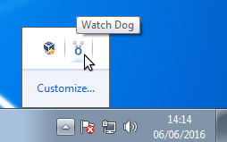
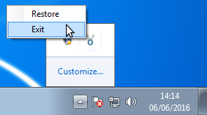
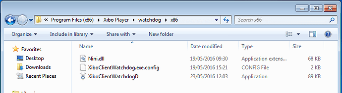

<!--toc=windows_install-->

# ウォッチドッグの終了/無効化

Windows Player は Player 起動時に自動的に Player ウォッチドッグアプリケーションを起動します。

これにより、何らかの理由でプレーヤーがクラッシュしたり、応答しなくなった場合でも、プレーヤーが再起動されるようになっています。

しかし、Xiboをしばらく閉じたい場合は、Alt+F4キーを押してプレーヤーアプリケーションを閉じると、数秒後にウォッチドッグが起動し、Xiboを再開します。このとき、ウォッチドッグアプリケーションも終了させる必要があります。

## ウォッチドッグアプリケーションを閉じる

システムトレイに移動し、ウォッチドッグのアイコンを見つけます。

アイコンを右クリックし、[終了]を選択して閉じます。

プレーヤー起動時にウォッチドッグが自動的に起動しないようにしたい場合（Xibo Playerを頻繁に切り替えたり、プレーヤーPCを他の用途に使用する場合など）、実行ファイル名を変更してウォッチドッグを無効化することができます。

## ウォッチドッグアプリケーションを無効にする

プレーヤーのインストールディレクトリを開き、watchdogx86 フォルダを探します。デフォルトでは、以下のディレクトリになります。

64ビットのワークステーションでは、`C:\Program Files (x86)\Xibo Player\watchdog\x86` 

32ビットのワークステーションでは、`C:\Progam Files\Xibo Player\watchdog\x86`

XiboClientWatchdog.exeを別の名前にリネームする。下の例では、Disabledの頭文字をとってDを付けていますが、他のファイル名でもかまいません。

これで、プレーヤーアプリケーションを起動しても、ウォッチドッグは自動的に起動されなくなります。
