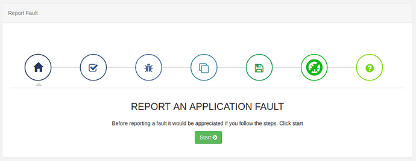

<!--toc=troubleshooting_faq-->

# 管理者向けトラブルシューティング

このトラブルシューティングセクションは、[[PRODUCTNAME]]システムの管理者向けの技術サポートを提供することを目的としています。管理者用ドキュメントには、[[PRODUCTNAME]]システムのインストールと設定に関する詳細な情報が記載されていますので、解決策を模索する前に、管理者の方によく理解していただくことをお勧めします。

## 監査ログ

CMSには、CMS内のユーザーとシステムタスクのアクティビティを表示するための専用ページがあります。左側のメニューから**監査ログ**を選択すると、詳細が表示されます。

## エラーログ

CMS には、CMS、プレイヤー、API、メンテナンスなど、プラットフォーム内のすべてのコンポーネントからメッセージを収集する中央の**ログ**があり、問題を調査する際の貴重なリソースとなります。

CMSのログは、メインメニューの**高度な設定**セクションにある**不具合報告**ページから提供することができます。

**開始**をクリックすると、troubleshoot.zipファイルを収集しダウンロードするためのステップを案内する障害ウィザードが表示されます。

{tip}
エラーログから関連情報を提供することは、サポート担当者が問題の解決策を見つけるための鍵となることがよくあります。
{/tip}

## 生のログ

CMSのメインメニューの**高度な設定**セクションにある**Log**をクリックすると、生のログを表示することができます。

{tip}
詳しくは、[ログ情報](xibo-log-information)をご覧ください。
{/tip}

## Xiboコミュニティフォーラム
Xiboコミュニティには、すでに回答された何千もの質問のアーカイブがあり、出発点として最適です。

コミュニティに投稿された質問には、コミュニティのメンバーだけでなく、専門家チームも回答しています。

コミュニティに参加して、新しい質問をしたり、既存のスレッドにサポートを提供したり、Xibo Hall of Fameにノミネートされましょう。

## お問い合わせ
ヘルプデスクは年中無休で、月曜日から金曜日の午前8時から午後4時30分まで（GMT/BST）、サポートエージェントが監視しています。

マイアカウントから以下の情報を入力し、新規チケットを作成してください。

1. ご使用のソフトウェアの**バージョン**
1. 発生している**問題**の説明
1. 弊社チームが問題を再現できるような詳細な**手順**。
1. CMSセントラル「エラーログ」から**トラブルシューティング用のZIPファイルをダウンロード**し、サポートチケットに添付してください。
1. プレイヤーステータス ページの**スクリーンショット**を添付してください。
