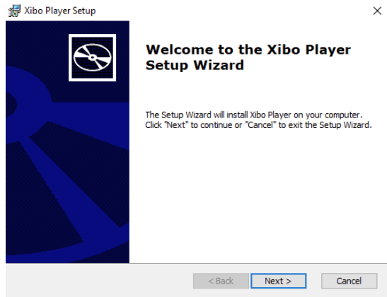
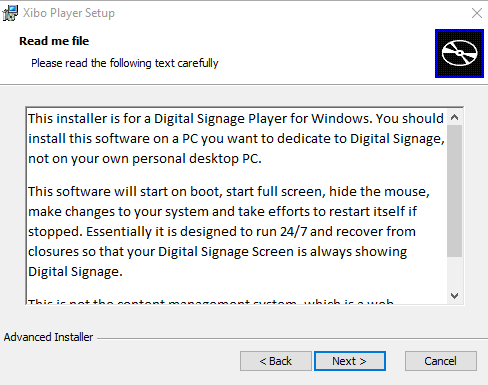
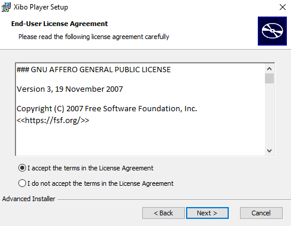
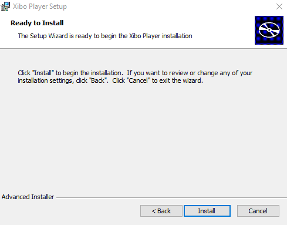
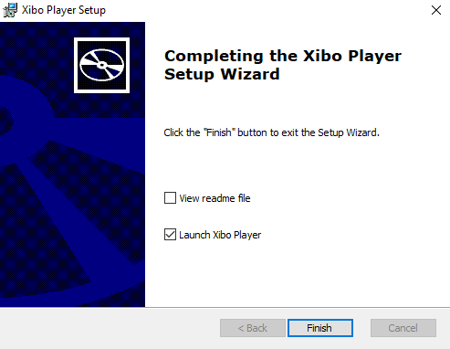
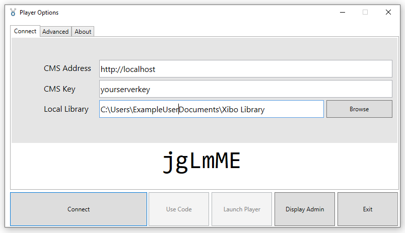
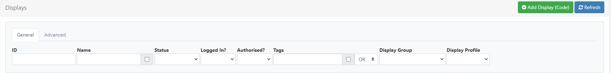
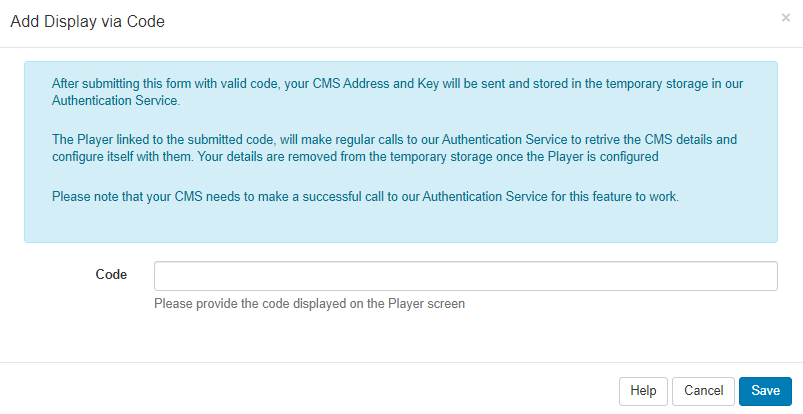

<!--toc=windows_install-->

# Windowsプレーヤーのインストール

**Windowsプレーヤー**は、Windowsインストーラーファイル（MSI）として配布され、標準的な「ダブルクリック」によるインストールが可能です。

4つのステップを踏んでください。

- **準備** - 最小要件とMSI
- **インストール** - MSIをダブルクリックし、インストール作業を開始します。
- **接続** - あなたのプレーヤーをCMSに接続します。
- **認証** - CMSであなたのディスプレイを認証します。

**プレーヤーを起動**

## 1. 準備 - 最小要件
[[PRODUCTNAME]] の実行には多くのリソースを必要としませんが、技術の進歩に伴い、いくつかの最小要件を設定する必要がありま した。インストール時に確認されますが、便宜上、以下に列挙します。

- CMSへのネットワーク接続（インターネット接続の可能性あり）
- Microsoft Windows 10 以降（下記注参照）
- Windows 10 からは、OS の「プロフェッショナル」バージョンを使用することが推奨されますのでご注意ください。「home」バージョンでは、自動更新のスケジュールを完全に制御することができなくなったため、サイネージの再生が中断されるメッセージが発生する可能性があります。
- .NET フレームワーク v4.7.3
- Visual C++ Redistributable for Visual Studio 2015-2019 x86（存在しない場合はダウンロードされます。）
- Internet Explorer 8 以上（IE11 以上を推奨）
- Flash Player バージョン 9 以降（Flash サポートが必要な場合）
- Windows Media Player 11 以上
- PowerPoint 対応の場合、Microsoft PowerPoint 2003 以降。PowerPointビューアーは適しません。
- `edge`ブラウザタグとHLSに対応するためには、Webview2ランタイムが必要です。ダウンロードは[こちら](https://developer.microsoft.com/en-us/microsoft-edge/webview2/#download-section)
- Windows 10 build 1909以降を推奨します。Enterprise LTSBはビデオ再生に問題があることが知られています。

## 2. インストール方法

Xibo for Windows をダウンロードし、`Xibo msi` ファイルをダブルクリックします。

インストーラーが、以下のような画面を表示します。

**注意**：インストール中にセキュリティの警告や、発行元不明のアプリによる変更を許可するかどうかを尋ねるメッセージが表示されることがあります。その場合は、"実行 "または "はい "をクリックして、インストールを続行してください。

- インストーラーが「ようこそ」画面を表示しますので、「Next」をクリックします。

- `Read me`ファイルを読み、「Next」をクリックします。

- **エンドユーザーライセンス契約書**を読み、同意する場合は 「Next」をクリックする。

- 「Install」をクリックするか、「Back」をクリックして確認します。

セットアップウィザードが起動し、Xiboプレイヤーのインストールが開始されます。

- インストールが完了したら、「Finish」をクリックしてセットアップウィザードを終了してください。

{tip}
インストールされるフォルダは、デフォルトで `C:\Program Files(x86)/xibo Player/` になります。
{/tip}

## 3. CMSに接続する

新規にインストールしたプレーヤーは、**プレーヤーオプション**を使用して、**[[PRODUCTNAME]] CMS** に設定・登録する必要があります。

{tip}
**プレーヤーオプション**ウィンドウは、プレーヤーから「スタートメニュー」を使って「すべてのプログラム」を選択することでアクセスできます。
プレーヤーオプションのほとんどは、CMS上で設定され、ネットワーク経由でプレーヤーに配信されます。これにより、新規インストール時にプレイヤーの設定を最小限に抑えることができます。
{/tip}

CMSからオプションを送信する前に、以下のいずれかの方法でCMSインスタンスに**ディスプレイ**を登録する必要があります。

- コードを使用する。

または

- 手動設定(CMSアドレスとキー)

### コードを使用する

- プレーヤーオプションから**Connect**タブを選択し、**Use Code**をクリックすると、6文字のアクティベーションコードが表示されます。

{tip}
**ディスプレイ**ページでコードを入力し、プレーヤーが自動的に起動するまで、このフォームが開いたままであることを確認してください。このフォームを閉じると、コードが非表示になり、設定プロセスが停止します。
{/tip}

- CMSの**ディスプレイ**ページに移動して、**ディスプレイを追加(Code)**をクリックします。

- **プレーヤーオプション**ウィンドウに表示されているコードを入力します。

- 保存

設定に成功すると、プレーヤーの起動ページが自動的に閉じます。

ディスプレイが登録されるので、**ディスプレイの認証**ステップに進み、セットアップを続行します。

### 手動設定

プレーヤーオプション]ウィンドウの[接続]タブから必要なフィールドを入力します。

CMSアドレス。CMS アドレス： これは、CMS インストールの完全修飾アドレスです。例：https://cms.example.org または http://example.org/cms
CMS キー。このディスプレイをCMSで認証するための秘密のCMSキーです。
CMSキーは、CMSのメインメニューの管理セクションの下にある設定タブの設定ページで確認することができます。
スクリーンショット/画像
ローカルライブラリ。プレーヤーがローカルファイルを保存する場所。ファイルはCMSからダウンロードされ、CMSとの接続が切れてもプレーヤーが機能するようにします。
すべての項目を入力したら、下の「接続」ボタンをクリックしてください。

最初の接続に成功すると、メッセージが表示されます。
スクリーンショット/画像
CMSとプレーヤー間の通信にエラーがない場合、ディスプレイは登録され、以下の「ディスプレイの認証」ステップで説明する認証待ちの状態になります。

プレーヤーの詳細設定
プレイヤー側でAdvancedタブからしか設定できない項目がいくつかあるので、以下に説明します。

プレーヤーは、登録プロセスおよび新しいコンテンツを取得するために、CMSにアクセスする必要があります。プレーヤーがプロキシサーバーに接続されている場合、そのサーバーの詳細を以下のフィールドに入力することができます。

プロキシ設定。
プロキシサーバーとの認証に使用するユーザー名。
プロキシサーバーとの認証に使用されるパスワード。
プロキシサーバーの認証に使用するドメイン。
その他の設定
ディスプレイID - このディスプレイの一意のID。インストール時に自動生成された一意のIDが割り当てられますが、必要に応じて変更することができます。
スプラッシュ画面 - プレーヤーPCにローカルに保存されている画像で、スプラッシュ画面を上書きすることができます。
4. 表示許可
プレーヤーがスケジュールされたイベントを受信し、レイアウト/キャンペーンを表示する前に、CMSに接続するためにディスプレイを認証する必要があります。

プレイヤーオプション]ウィンドウから[ディスプレイ管理]をクリックするか、CMSにログインしてメインメニューから[ディスプレイ]をクリックすると、リストに新しく登録されたプレイヤーが表示されます。
v1.8.7以前のCMSを使用している場合は、「編集」をクリックし、最初のタブから「認証」を選択して保存してください。
スクリーンショット/画像
新しく追加されたプレーヤーの行メニューを使用し、リストから[認証]を選択します。

はい]をクリックして、このディスプレイの認証を確認します。
この時点で、新しいプレーヤーが実行するデフォルトレイアウトを選択することができます。
スクリーンショット/画像
ディスプレイのプロファイルを設定する
一度登録されると、プレーヤーにはデフォルトのディスプレイ設定プロファイルが与えられます。

詳細は、ユーザーマニュアルのディスプレイ設定のページを参照してください。
スクリーンショット/画像
Xiboプレイヤーの起動
プレイヤーオプションから「プレイヤーの起動」を選択するか、「すべてのプログラム」から「Xibo Player」をクリックしてください。デフォルトレイアウトとそのメディアコンテンツ（および予約したもの）がダウンロードされる間、Xiboのスプラッシュスクリーンが表示されるはずです。

その後、プレーヤーはレイアウトコンテンツの再生を開始します。

