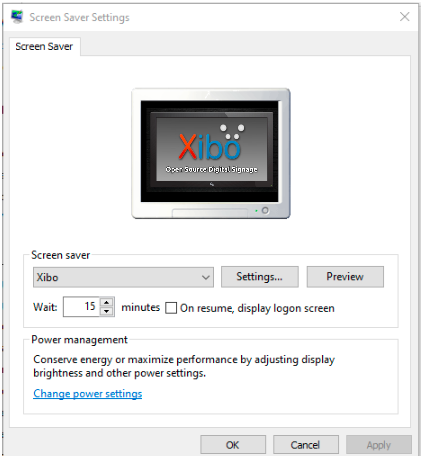

<!--toc=windows_install-->

# スクリーンセーバー 

Windowsプレーヤーは、Xiboをスクリーンセーバーとして実行するために使用できる`Xibo.scr`ファイルをインストールプログラムファイル内にインストールしています。

スクリーンセーバーは、インストールフォルダに移動して`Xibo.scr`ファイルを右クリックし、「インストール」を選択することでインストールすることができます。

すると、以下のようなウィンドウズスクリーンセーバーの設定ダイアログボックスが表示されます。

## 設定

スクリーンセーバーの設定ダイアログで**設定**をクリックすると、プレーヤーのオプションを設定することができます。

{tip}
**注意：**これらの設定は、同じPC上の既存のプレーヤーで設定された設定とは独立したものです。
{/tip}
